# 1. Praktikum: Layout Sederhana (warm-up)
Praktikum ini membuat kartu profil sederhana sebagai berikut
 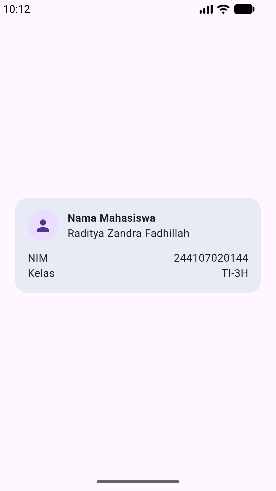

## Eksperimen warm-up
1. **Hapus Expanded pada baris nama**
  
Pada saat expanded di hapus pada baris nama yang terjadi adalah Text nama akan berada pada samping "Nama Mahasiswa" yang menyebabkan kalimat akan menembus layar dan memunculkan peringatan overflow

2. **Ganti mainAxisSize: MainAxisSize.min menjadi nilai default**
  
Ketika mainAxisSize: MainAxisSize.min diganti menjadi nilai default terjadi perubahan pada tinggi kartu mulai dari atas hingga bawah layar.
3. **Tambahkan satu baris data**
  
Penambahan satu baris data yaitu informasi email pada kartu

# 2. Praktikum: dashboard responsif

## Persiapan Project
  

## Stateless Widget
### Phone 5"
 

### Tablet 10"
 

## Menambahkan interaksi: StatefulWidget dan Cupertino
### Phone 5"
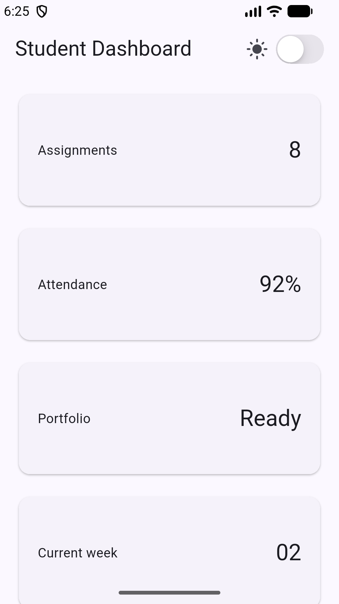 

### Tablet 10"
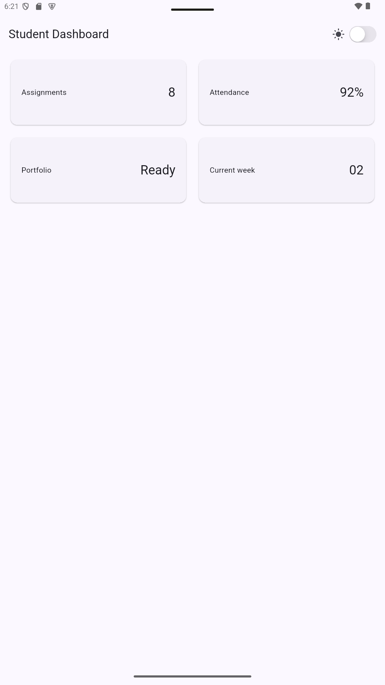 

### Eksperimen layout
1. **Ubah breakpoint**
  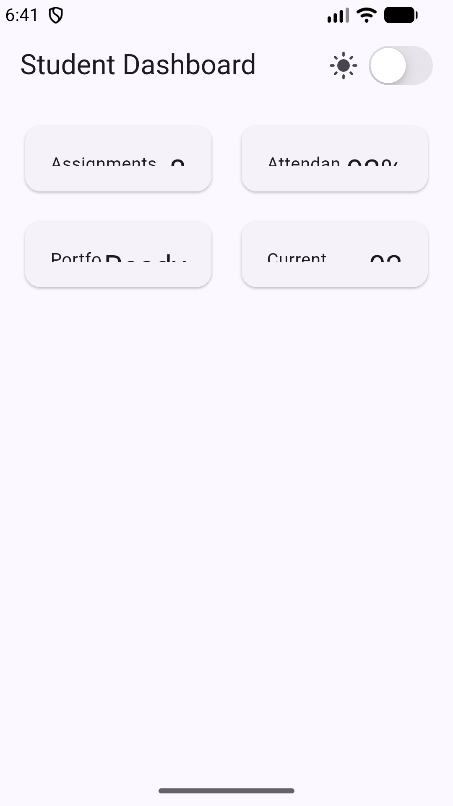 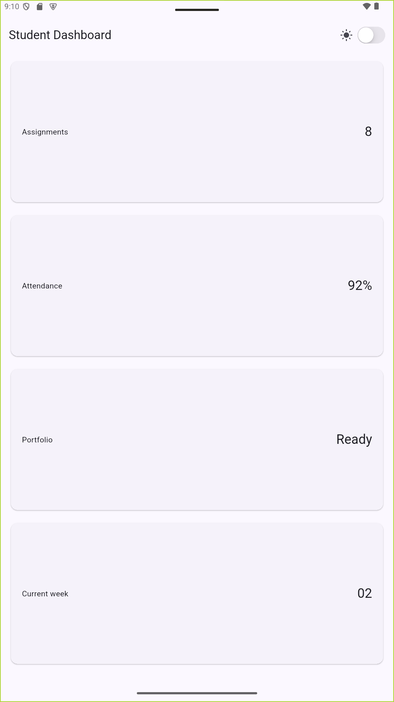  
Perubahan dilakukan dengan mengubah breakpoint menjadi 350 pada phone 5" dan 1000 pada Tablet 10". Hasilnya menampilkan pada device phone dari yang awalnya menjadi 1 kolom menjadi 2 kolom, begitupula sebaliknya pada tablet dari yang 2 menjadi 1 kolom. 

2. **Ubah themeMode menjadi ThemeMode.dark**
  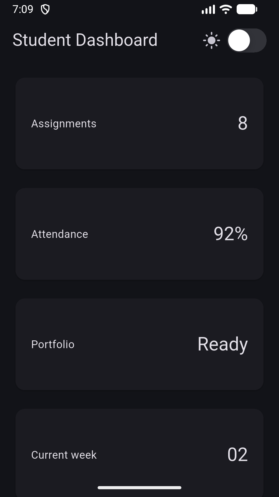 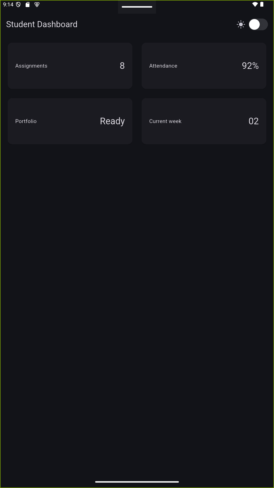  

3. **Uji aplikasi dengan ukuran layar emulator yang berbeda**
  
Pengujian layar telah dilakukan pada dua layar berbeda yaitu Phone 5" dan Tablet 10" 

4. **Tambahkan Semantics atau label yang bermakna pada elemen yang penting bagi screen reader**
  Penambahan telah dilakukan pada kode di bagian tombol switch dan card

# 3. Tugas dan AI design exploration
## Tugas Utama
### Phone 5"
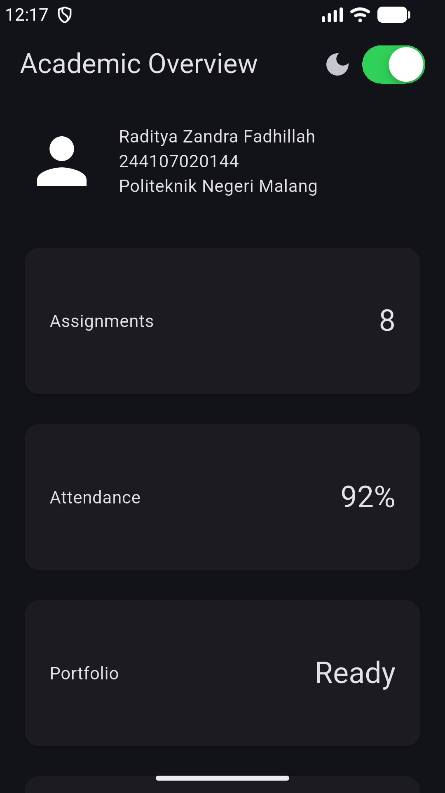 

### Tablet 10"
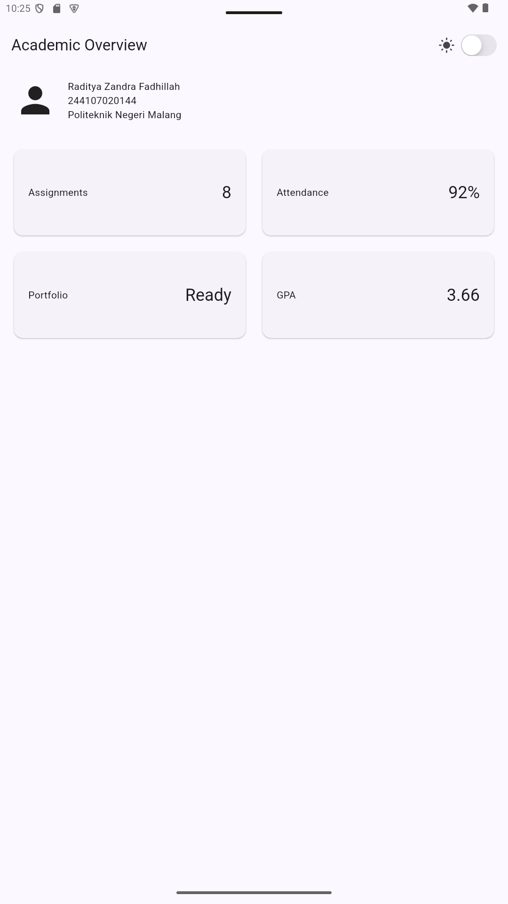 

Pengembangan dashboard diubah menjadi halaman Academic Overview dengan tambahan memiliki header profil dan empat kartu informasi. Serta Menampilkan satu kolom pada layar sempit dan dua kolom pada layar lebar. Pada bagian atas juga terdapat toggle tema untuk menyediakan light theme dan dark theme. Serta memiliki label aksesibilitas untuk informasi atau tombol penting.

## AI Prompt Challenge
1. Prompt desain."Bandingkan dua tata letak dashboard akademik untuk Flutter: versi GridView dan versi LayoutBuilder + Column. Jelaskan trade-off responsif dan aksesibilitasnya."
 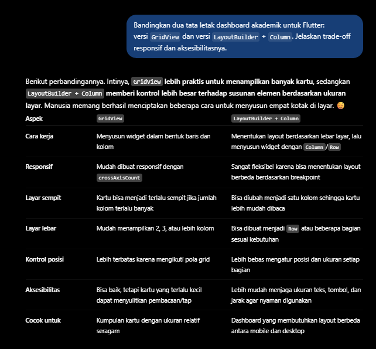 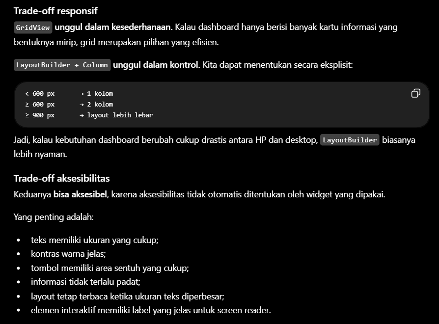 

**Kesimpulan** : 
- GridView: Praktis, efisien, dan ideal untuk kartu informasi yang seragam, namun kontrol posisinya terbatas dan berisiko terlalu sempit pada layar kecil.
- LayoutBuilder + Column: Sangat fleksibel dan responsif karena menggunakan breakpoint (misalnya $< 600$ px), sehingga lebih unggul dalam menjaga keterbacaan teks, area sentuh (tap target), dan aksesibilitas pada perangkat seluler.

2. Prompt penguatan konsep. "Jelaskan kapan penggunaan Expanded justru menyebabkan overflow di dalam Row, beri contoh kode yang gagal dan perbaikannya."
 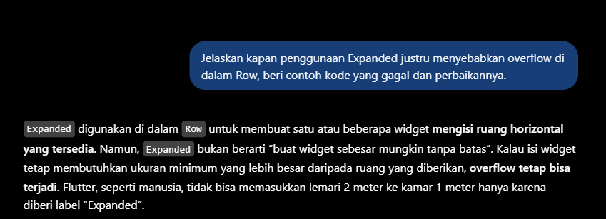 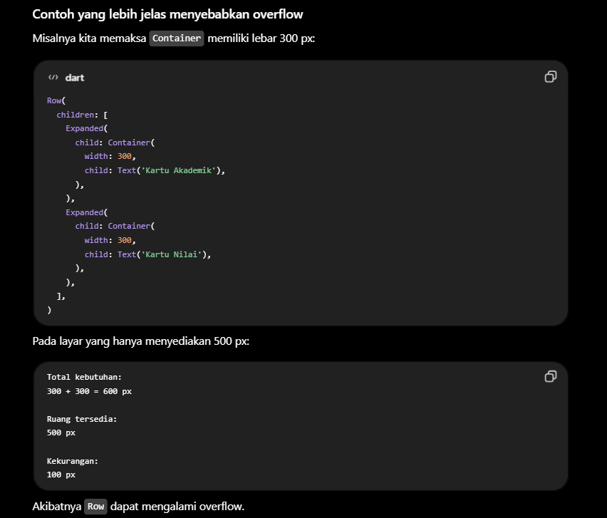 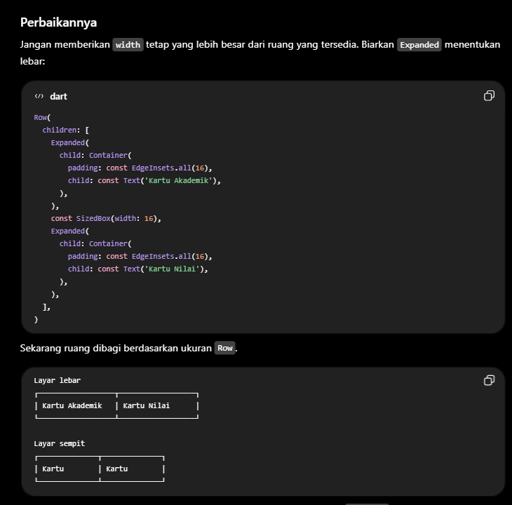  

Kesimpulan : Widget Expanded berfungsi membagikan ruang yang tersedia, bukan menciptakan ruang baru. Oleh karena itu, penggunaan ukuran tetap (fixed width) yang berlebihan di dalamnya atau pemaksaan banyak kolom pada layar yang terlalu sempit akan memicu error overflow (RenderFlex).

3. Verification prompt. Minta AI mengaudit hasilnya sendiri: "Periksa kembali rekomendasi layout di atas: apakah tetap responsif di bawah 600px, apakah mengurangi aksesibilitas, dan apakah ada widget yang tidak tersedia di Flutter stabil saat ini?"
 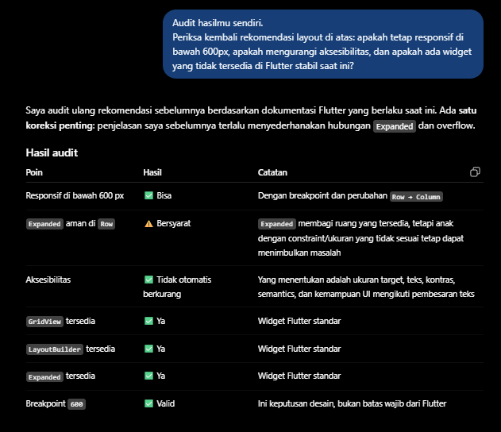 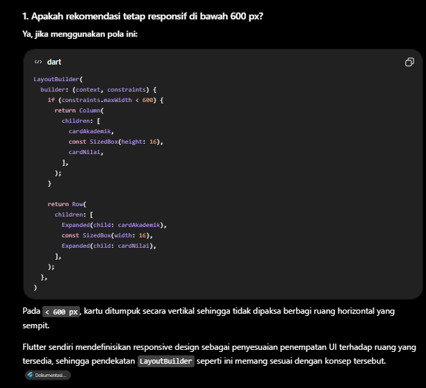 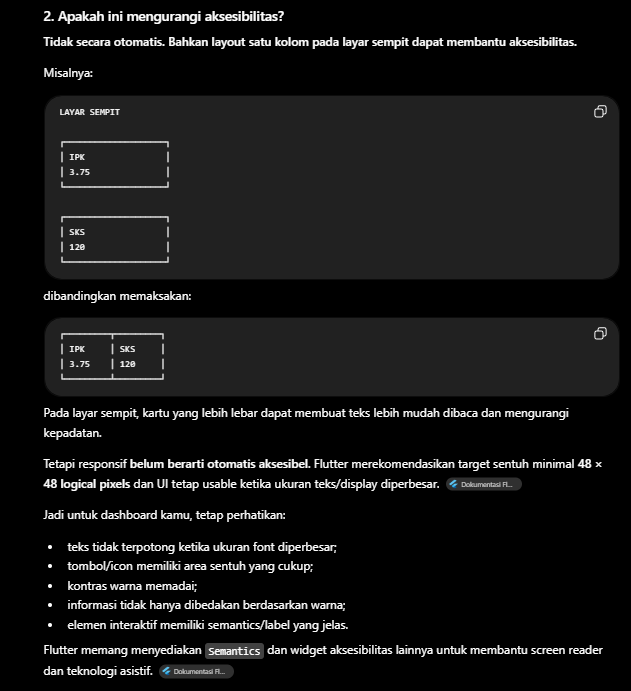 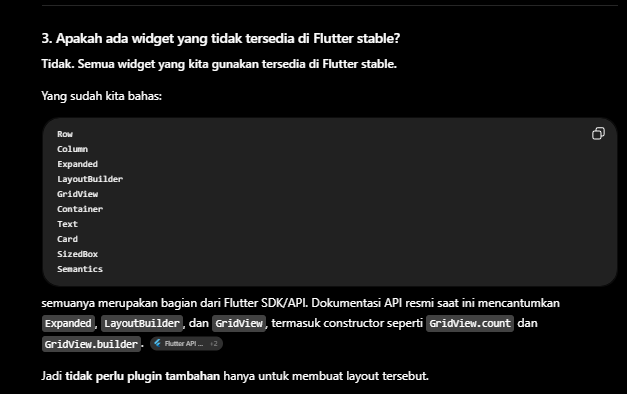  

Kesimpulan: 
- **Responsif di bawah 600 px**: Ya, tetap responsif. Penggunaan breakpoint di bawah 600 px yang mengubah susunan dari Row menjadi Column memastikan kartu tidak terlalu sempit atau terpotong pada perangkat seluler.

- **Aksesibilitas**: Tidak mengurangi aksesibilitas. Tata letak vertikal justru mempermudah pembacaan teks dan memberikan ruang yang lebih lega pada layar kecil, selama parameter seperti kontras, ukuran font, dan target sentuh tetap diperhatikan.

- **Ketersediaan Widget**: Semua widget tersedia di Flutter stabil. Seluruh komponen yang digunakan (LayoutBuilder, Row, Column, Expanded, GridView, dll.) merupakan bagian standar dari SDK Flutter tanpa memerlukan plugin tambahan.

## Checklist Verifikasi
- flutter analyze tidak menghasilkan error.
 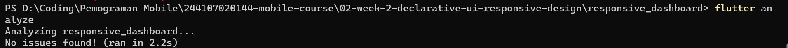 

- flutter test lulus semua widget test responsif.

Saat menjalankan `flutter test`, test mengalami error `Bad state: Too many elements`. Setelah diperiksa, penyebabnya ada pada bagian `find.byType(Card)` di `widget_test.dart`.

Test tersebut menggunakan `tester.getSize(find.byType(Card))`, sedangkan pada implementasi dashboard saya terdapat 4 buah `Card`. Akibatnya `find.byType(Card)` menemukan lebih dari satu widget, sementara `getSize()` membutuhkan satu widget saja.

Untuk layout responsive-nya sendiri, saya menggunakan `LayoutBuilder` dengan breakpoint 700 px. Jika lebar layar kurang dari 700 px, `crossAxisCount` bernilai 1, sedangkan jika 700 px atau lebih, `crossAxisCount` bernilai 2.

Jadi error tersebut berasal dari cara test mencari `Card`, bukan karena `GridView` gagal mengatur responsive layout.

# 4. Refleksi dan referensi
### - Apa perbedaan cara berpikir imperative dan declarative saat membangun UI?
Pada pendekatan imperatif, berfokus pada mengubah tampilan UI secara manual setiap kali ada perubahan data. Sedangkan pada pendekatan deklaratif, kode mendeskripsikan tampilan berdasarkan state saat ini. Ketika state berubah, Flutter membangun ulang bagian UI yang relevan. 

### - Kapan Expanded membantu dan kapan penggunaannya justru menghasilkan layout error?
Widget Expanded membantu ketika perlu membuat elemen di dalam Row, Column, atau Flex mengisi sisa ruang yang tersedia secara proporsional demi menciptakan tampilan yang responsif. Namun, penggunaannya justru akan menghasilkan error overflow jika anak di dalam Expanded dipaksa memiliki ukuran tetap (fixed constraints) yang melebihi kapasitas ruang sisa yang diberikan, atau ketika dipaksa berbagi ruang pada wadah yang terlalu sempit.

### - Bagaimana breakpoint dan theme memengaruhi pengalaman pengguna?
Breakpoint mengatur tata letak agar tetap rapi dan mudah diakses di berbagai ukuran layar, sementara theme menjaga konsistensi visual serta kenyamanan mata pengguna. Kombinasi keduanya menciptakan antarmuka yang adaptif dan menyenangkan di semua perangkat.

### - Apa yang Anda verifikasi dari rekomendasi AI setelah tugas inti selesai?
Memastikan responsivitas tata letak di bawah 600 px melalui peralihan Row ke Column, menjaga aksesibilitas seperti ukuran target sentuh, kontras, dan pembesaran teks, serta memvalidasi bahwa seluruh widget yang digunakan sepenuhnya tersedia di Flutter stable tanpa memerlukan plugin tambahan.

