# Week 3 - Navigation & State Management

## 1. Praktikum: Aplikasi Multi-page dengan GoRouter

Pada praktikum pertama dibuat aplikasi dengan dua halaman menggunakan **GoRouter**, yaitu halaman Home dan Detail.

Pada halaman Home terdapat beberapa item. Ketika salah satu item dipilih, aplikasi akan berpindah ke halaman Detail dan menampilkan ID item yang dipilih.

### Home Page

<br>
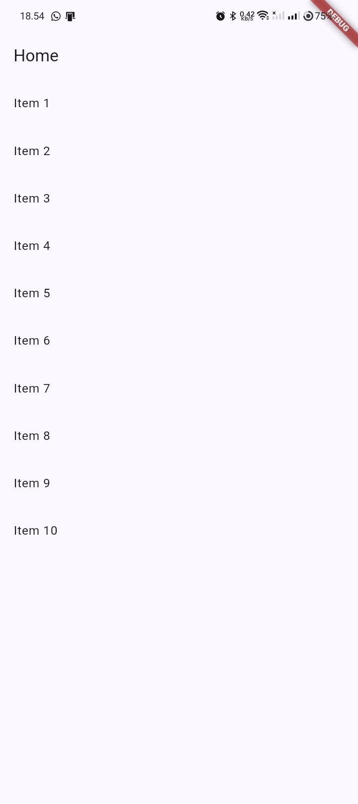
<br>

### Detail Page

<br>
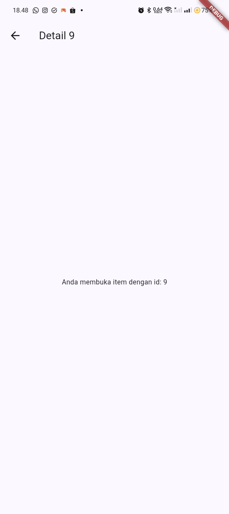
<br>

Dari praktikum ini saya memahami penggunaan `MaterialApp.router`, `GoRouter`, dan path parameter seperti `/detail/:id` untuk melakukan navigasi antar halaman.

---

# 2. Praktikum: Aplikasi ToDo dengan Riverpod

Pada praktikum kedua dibuat aplikasi ToDo menggunakan **Riverpod** sebagai state management.

State daftar tugas dikelola menggunakan `Notifier` dan `NotifierProvider`, sedangkan halaman menggunakan `ConsumerWidget` untuk membaca state.

Beberapa fitur yang dibuat yaitu:

- Menambahkan tugas.
- Menandai tugas selesai.
- Menghapus tugas.
- Menampilkan kondisi ketika daftar tugas kosong.

## Kondisi Awal

Ketika belum terdapat tugas, aplikasi menampilkan tulisan **Belum ada tugas**.

<br>
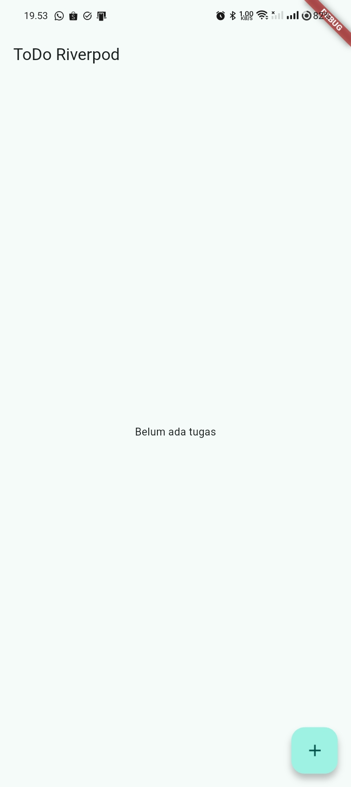
<br>

## Menambahkan Tugas

Penambahan tugas dilakukan melalui dialog yang muncul ketika tombol tambah ditekan.

<br>
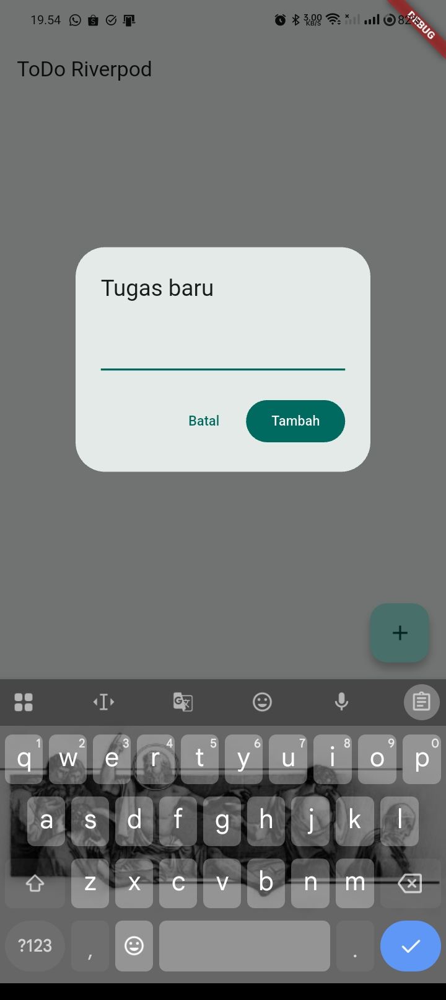
<br>

## Daftar Tugas

Setelah tugas ditambahkan, data akan langsung muncul pada halaman.

<br>
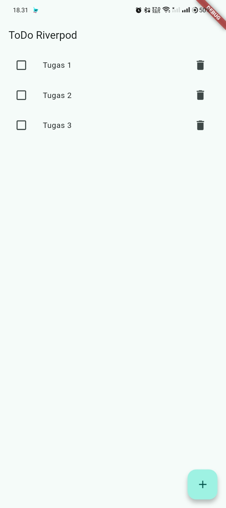
<br>

## Menandai Tugas Selesai

Checkbox digunakan untuk mengubah status tugas menjadi selesai.

<br>
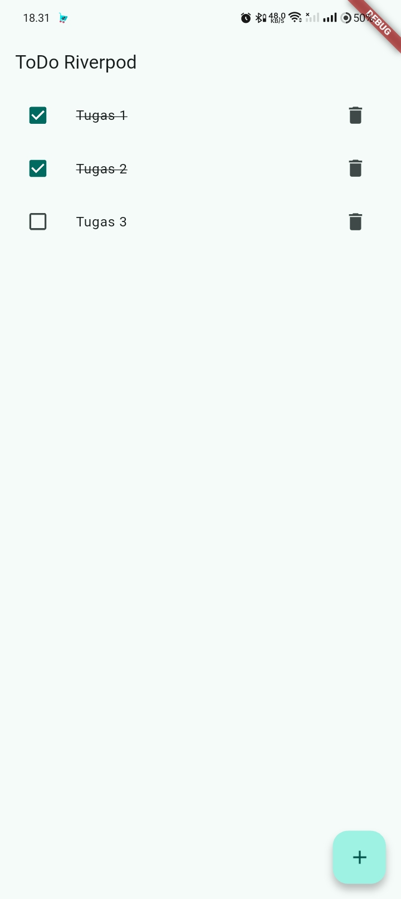
<br>

## Menghapus Tugas

Tugas juga dapat dihapus menggunakan tombol delete.

<br>
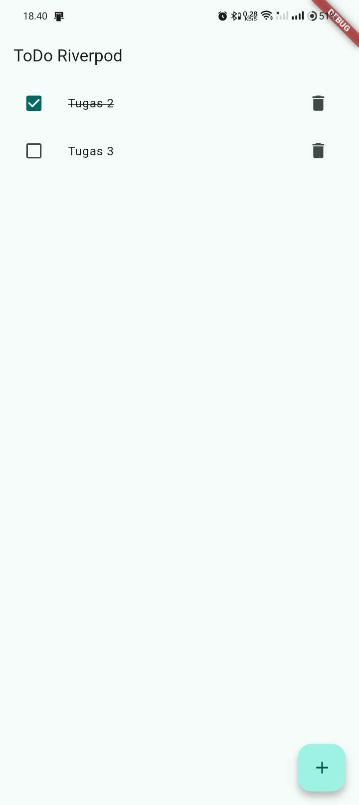
<br>

Pada bagian ini saya memahami bahwa `ref.watch` digunakan untuk membaca state dan melakukan rebuild ketika data berubah, sedangkan `ref.read` digunakan ketika memanggil method provider dari sebuah aksi atau callback.

---

# 3. Praktikum: AsyncValue

Pada praktikum ini dipelajari penggunaan `AsyncValue` untuk menangani proses asynchronous.

Terdapat tiga kondisi utama yaitu:

- Loading
- Error
- Success

## Loading State

Saat proses pengambilan data berlangsung, aplikasi menampilkan loading indicator.

<br>
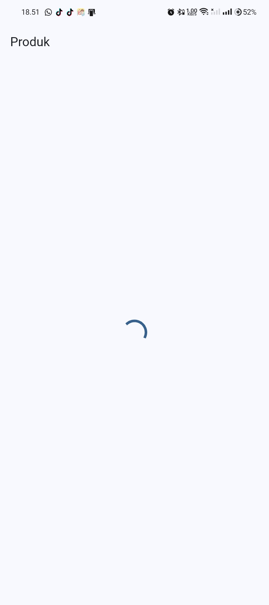
<br>

## Success State

Ketika data berhasil diperoleh, aplikasi menampilkan daftar produk.

<br>
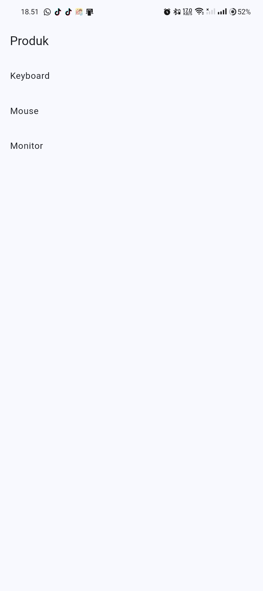
<br>

## Error State

Untuk mencoba kondisi error, proses pengambilan data dibuat menghasilkan exception.

<br>
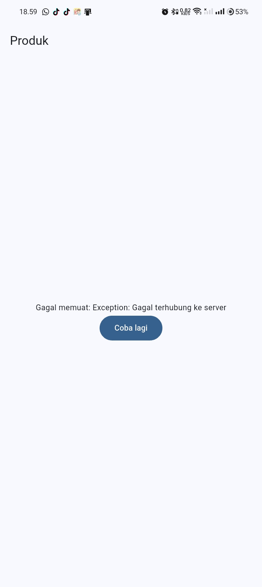
<br>

Dengan `AsyncValue`, kondisi loading, error, dan success dapat ditangani dalam satu state sehingga lebih mudah daripada menggunakan beberapa boolean secara terpisah.

---

# 4. AI Prompt Challenge

Pada AI Challenge saya menggunakan **GitHub Copilot** sebagai co-developer untuk membantu membuat halaman `StatsPage`.

Prompt yang digunakan:

```text
Buatkan halaman Flutter bernama StatsPage menggunakan flutter_riverpod.
Requirements:
- ConsumerWidget dengan satu AsyncNotifierProvider yang mensimulasikan
  pengambilan data statistik (delay 2 detik, kadang gagal 30%).
- UI harus menangani loading (spinner), error (pesan + tombol retry),
  dan success (ListView 3 item).
- Berikan unit test untuk notifier-nya.
Jelaskan setiap bagian kode dalam komentar.
```

## Hasil StatsPage

<br>
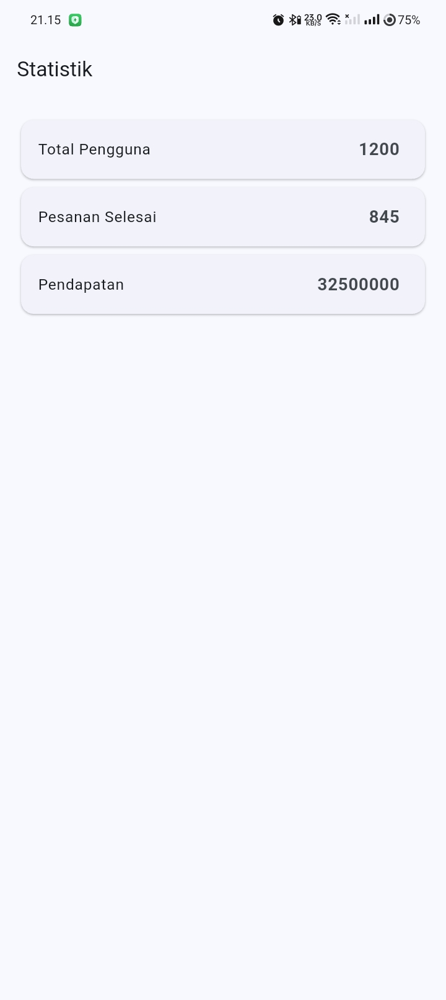
<br>

Halaman Statistik menggunakan `AsyncNotifierProvider` dan menangani tiga kondisi `AsyncValue`, yaitu loading, error, dan success.

Kode dari AI tidak langsung digunakan. Saya melakukan pemeriksaan dan beberapa perbaikan sebelum kode digunakan pada project.

Dokumentasi AI disimpan pada folder:

```text
docs/
├── prompt.md
├── output_ai.md
├── verification.md
├── perbaikan.md
└── testing.md
```

## Verifikasi Hasil AI

Beberapa hal yang diperiksa dari hasil AI:

- State tidak dimodifikasi langsung menggunakan `state.add()`.
- `ref.watch` digunakan pada bagian `build`.
- Loading, error, dan success sudah ditangani.
- Provider menggunakan `AsyncNotifierProvider`.
- Provider dibuat dengan tipe eksplisit.
- Unit test tersedia.
- Kode diperiksa menggunakan `flutter analyze` dan `flutter test`.

Beberapa bagian yang saya perbaiki adalah deklarasi tipe provider, constructor `StatsNotifier`, unit test asynchronous, dan retry Riverpod pada unit test.

---

# 5. Refactoring Challenge

## 1. Memisahkan TodoTile

Widget ToDo yang sebelumnya berada langsung pada `TodoPage` dipisahkan menjadi file:

```text
lib/widgets/todo_tile.dart
```

Hal ini dilakukan agar kode `TodoPage` menjadi lebih pendek dan widget lebih mudah digunakan kembali.

## 2. Membuat Provider Filter

Logika filter dipisahkan menjadi provider turunan yang membaca `todoListProvider`.

Provider tersebut digunakan untuk menampilkan tugas yang belum selesai.

<br>
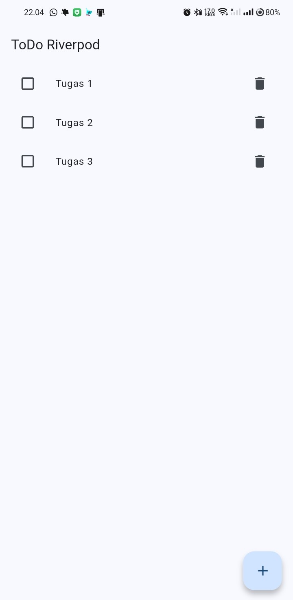 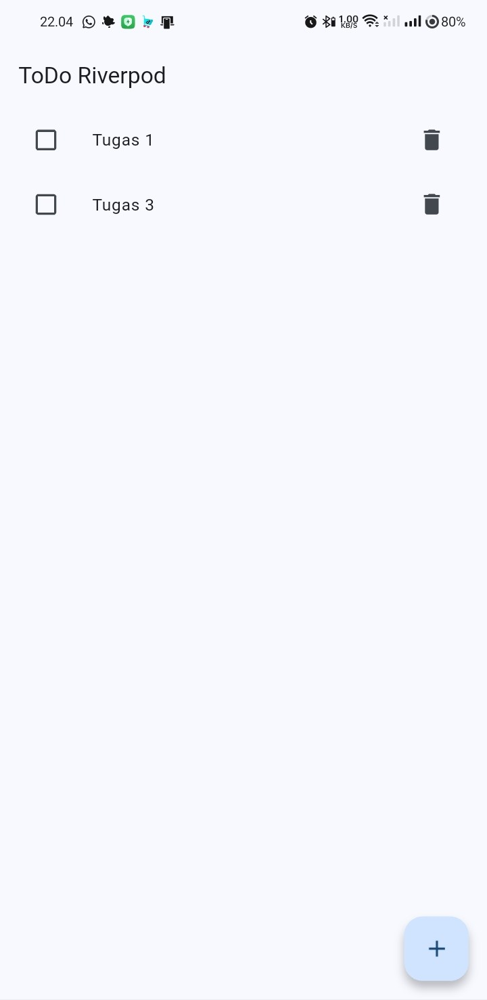
<br>

Dengan cara ini logika filter tidak perlu ditulis langsung pada bagian UI.

## 3. Integrasi GoRouter dan NavigationBar

Aplikasi ToDo kemudian dihubungkan dengan halaman Statistik menggunakan GoRouter.

Route yang digunakan:

```text
/       -> TodoPage
/stats  -> StatsPage
```

Pada bagian bawah aplikasi juga ditambahkan `NavigationBar` untuk berpindah antara halaman **ToDo** dan **Statistik**.

### Halaman ToDo

<br>
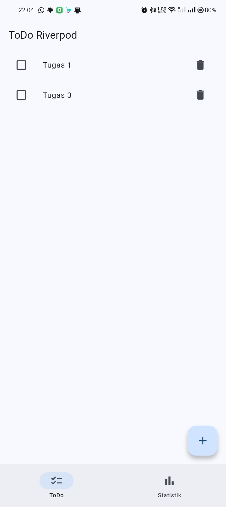
<br>

### Halaman Statistik

<br>
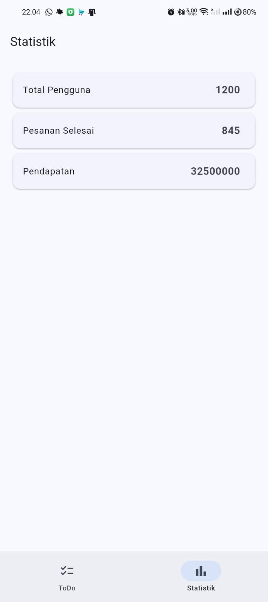
<br>

---

# 6. Testing

Testing dilakukan menggunakan:

```bash
flutter analyze
flutter test
```

Hasil `flutter analyze`:

```text
No issues found!
```

Hasil `flutter test`:

```text
+3: All tests passed!
```

<br>

<br>

Unit test digunakan untuk menguji kondisi berhasil dan gagal pada `StatsNotifier`.

Widget test digunakan untuk memastikan tugas baru dapat ditambahkan melalui halaman ToDo.

Pada proses testing sempat ditemukan beberapa masalah, seperti widget test lama yang masih menguji counter, `ProviderScope` yang belum ditambahkan pada test, dan retry Riverpod yang menyebabkan test error membutuhkan waktu terlalu lama.

Setelah diperbaiki seluruh test berhasil dijalankan.

---

# 7. Mini Project

Mini project pada Week 3 adalah aplikasi **ToDo dengan Navigation dan Riverpod**.

Fitur utama yang berhasil dibuat:

- Menambahkan ToDo.
- Menghapus ToDo.
- Mengubah status ToDo.
- State dikelola menggunakan Riverpod.
- Menggunakan `Notifier` dan `ConsumerWidget`.
- Filter tugas menggunakan provider turunan.
- Halaman ToDo dan Statistik menggunakan GoRouter.
- NavigationBar untuk berpindah halaman.
- StatsPage menggunakan `AsyncValue`.
- Loading, error, dan success dapat ditampilkan.
- Unit test dan widget test berhasil dijalankan.

## Teknologi yang Digunakan

- Flutter
- Dart
- Flutter Riverpod
- GoRouter
- Material 3
- Flutter Test
- GitHub Copilot

## Cara Menjalankan

Masuk ke folder project:

```bash
cd week3_todo
```

Install dependency:

```bash
flutter pub get
```

Jalankan aplikasi:

```bash
flutter run
```

Untuk melakukan pengecekan:

```bash
flutter analyze
flutter test
```

---

# 8. Refleksi

### - Kapan `setState` masih cukup, dan kapan state harus menggunakan Riverpod?

`setState` masih cukup digunakan ketika state hanya digunakan pada satu widget atau satu halaman dengan logika yang sederhana.

Riverpod lebih cocok ketika state mulai digunakan oleh beberapa widget, memiliki logika yang lebih kompleks, atau perlu dipisahkan dari UI agar lebih mudah dikelola dan diuji.

Pada aplikasi ini daftar ToDo menggunakan Riverpod karena data dan perubahan state dikelola melalui `Notifier`.

### - Apa perbedaan `context.go` dan `context.push`?

`context.go` digunakan untuk berpindah ke route tertentu dengan mengganti lokasi yang sedang aktif. Pada project ini digunakan pada NavigationBar untuk berpindah antara halaman ToDo dan Statistik.

Sedangkan `context.push` menambahkan halaman baru ke navigation stack sehingga cocok digunakan ketika membuka halaman detail dan ingin kembali ke halaman sebelumnya.

### - Bagaimana `AsyncValue` mencegah bug dibanding tiga boolean terpisah?

Dengan tiga boolean seperti `isLoading`, `isError`, dan `isSuccess`, terdapat kemungkinan lebih dari satu kondisi aktif secara bersamaan.

`AsyncValue` sudah menyediakan kondisi loading, error, dan data dalam satu state sehingga kondisi UI menjadi lebih jelas dan lebih mudah dikontrol.

### - Bagian mana dari hasil AI yang diperbaiki, dan mengapa?

Beberapa bagian yang saya perbaiki dari hasil AI yaitu tipe provider dibuat lebih eksplisit, constructor `StatsNotifier` diperbaiki setelah menjalankan `flutter analyze`, dan unit test error diperbaiki karena prosesnya asynchronous.

Selain itu retry otomatis Riverpod pada unit test juga dinonaktifkan agar test error tidak mengalami timeout.

Widget test bawaan Flutter juga diganti menjadi test yang sesuai dengan aplikasi ToDo.

---

# Referensi

- Slide Navigation & State Management
- Flutter Navigation Overview
- GoRouter Package
- Riverpod Getting Started
- Riverpod AsyncNotifier dan AsyncValue
- Learn Dart in Y Minutes