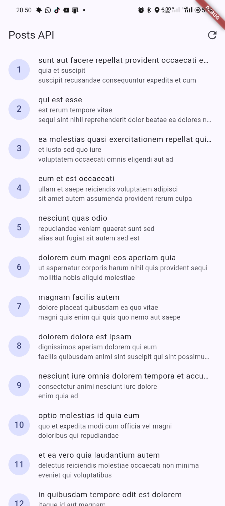
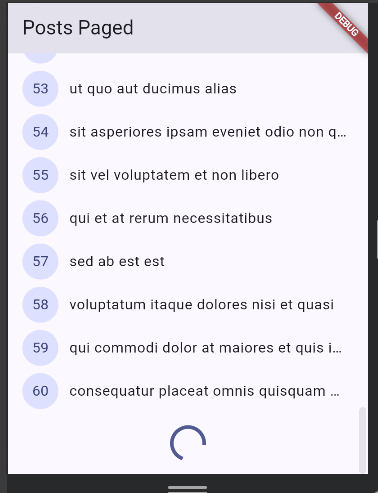
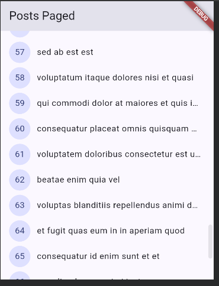
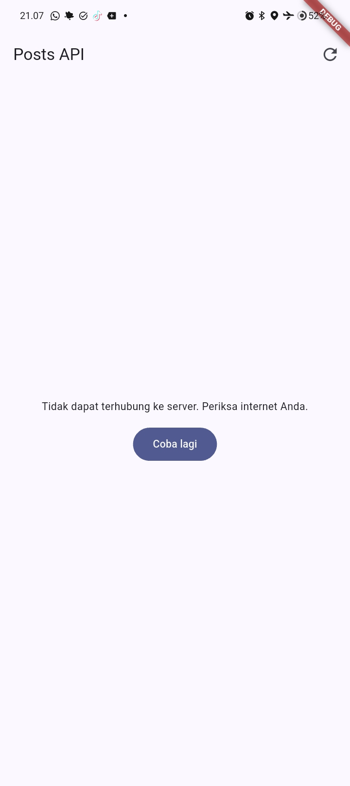
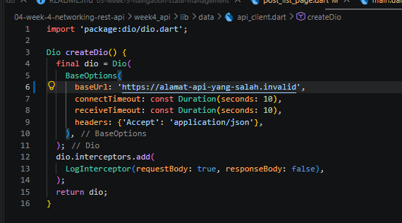
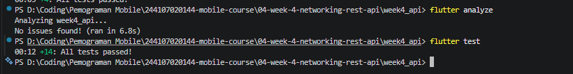

# Week 4 - Networking & REST API

## Deskripsi

Project ini merupakan tugas praktikum Week 4 pada mata kuliah Pemrograman Mobile. Pada minggu ini saya mempelajari cara mengambil data dari REST API menggunakan Flutter.

API yang digunakan adalah **JSONPlaceholder**, sedangkan untuk mengambil data dari API saya menggunakan **Dio**. Data yang sudah didapat kemudian dikelola menggunakan **Riverpod** sebelum ditampilkan ke halaman aplikasi.

Pada project ini saya juga belajar tentang repository, error handling, pagination, testing, penggunaan GoRouter, dan penggunaan AI untuk membantu membuat sebagian kode.

---

## Tujuan

Tujuan dari praktikum ini adalah:

- Mempelajari cara mengambil data dari REST API.
- Mempelajari penggunaan Dio pada Flutter.
- Memahami fungsi repository.
- Menggunakan Riverpod untuk mengatur state.
- Menampilkan kondisi loading, error, empty, dan success.
- Membuat pagination sederhana.
- Membuat halaman detail post.
- Melakukan testing tanpa harus menggunakan internet.
- Mempelajari cara memeriksa dan memperbaiki kode yang diberikan AI.

---

## Teknologi yang Digunakan

Pada project ini saya menggunakan:

- Flutter
- Dart
- Dio
- Flutter Riverpod
- GoRouter
- JSONPlaceholder
- Flutter Test

---

## API yang Digunakan

API yang digunakan adalah JSONPlaceholder.

Base URL:

```text
https://jsonplaceholder.typicode.com
```

Beberapa endpoint yang digunakan:

### Mengambil data post

```text
GET /posts
```

### Mengambil post dengan pagination

```text
GET /posts?_page={page}&_limit=10
```

### Mengambil detail post

```text
GET /posts/{id}
```

### Mengambil komentar berdasarkan post

```text
GET /comments?postId={id}
```

Endpoint komentar digunakan pada bagian AI Challenge.

---

# Praktikum 1 - Model Data dan API Client

Pada Praktikum 1 saya mulai membuat model untuk data dari API dan membuat konfigurasi Dio.

## Model Post

Model `Post` dibuat pada:

```text
lib/data/models/post.dart
```

Model digunakan untuk menampung data post yang berasal dari JSONPlaceholder.

Data JSON dari API diubah menjadi object `Post` menggunakan `fromJson()`.

Saya menggunakan nilai default jika terdapat field yang kosong atau tidak tersedia.

Contohnya:

```text
Field angka  → 0
Field String → ''
```

Hal ini dilakukan supaya program tidak langsung mengalami error jika terdapat field yang bernilai null.

---

## API Client

Konfigurasi Dio dibuat pada:

```text
lib/data/api_client.dart
```

Pada file tersebut terdapat beberapa konfigurasi seperti:

- Base URL API.
- Connection timeout 10 detik.
- Send timeout 10 detik.
- Receive timeout 10 detik.
- Header JSON.
- `LogInterceptor`.

Contoh konfigurasi yang digunakan:

```dart
Dio createDio() {
  final dio = Dio(
    BaseOptions(
      baseUrl: 'https://jsonplaceholder.typicode.com',
      connectTimeout: const Duration(seconds: 10),
      sendTimeout: const Duration(seconds: 10),
      receiveTimeout: const Duration(seconds: 10),
      headers: {'Accept': 'application/json'},
    ),
  );

  dio.interceptors.add(
    LogInterceptor(
      requestBody: true,
      responseBody: false,
    ),
  );

  return dio;
}
```

Konfigurasi Dio dibuat pada satu tempat supaya base URL dan timeout tidak perlu ditulis berulang kali.

---

# Praktikum 2 - Repository, Riverpod, dan Tampilan Data

Pada Praktikum 2 saya mulai mengambil data post dari API dan menampilkannya ke aplikasi.

Saya menggunakan alur:

```text
UI
 ↓
Provider
 ↓
Repository
 ↓
Dio
 ↓
API
```

Jadi halaman aplikasi tidak mengambil data langsung menggunakan Dio.

---

## Repository

Repository dibuat pada:

```text
lib/data/repositories/post_repository.dart
```

Repository digunakan untuk mengambil data dari API.

Setelah data berhasil didapat, data tersebut diubah menjadi `List<Post>` kemudian dapat digunakan oleh provider.

Dengan cara ini, kode untuk mengambil data API tidak dicampur langsung dengan kode tampilan.

---

## Riverpod

Riverpod digunakan untuk mengatur data dan state yang akan ditampilkan pada aplikasi.

Pada aplikasi terdapat empat kondisi utama.

### Loading

Ketika aplikasi sedang mengambil data, akan muncul:

```text
CircularProgressIndicator
```

### Error

Jika terjadi masalah ketika mengambil data, aplikasi akan menampilkan pesan error.

Contohnya:

```text
Tidak dapat terhubung ke server. Periksa internet Anda.
```

Terdapat juga tombol:

```text
Coba lagi
```

untuk mencoba mengambil data kembali.

### Empty

Jika data yang didapat kosong, aplikasi akan menampilkan:

```text
Belum ada data dari server.
```

### Success

Jika data berhasil didapat, post akan ditampilkan menggunakan `ListView`.

---

## Refresh Data

Pada halaman post juga terdapat tombol refresh.

Selain itu, data juga dapat di-refresh menggunakan `RefreshIndicator`.

---

## Hasil Praktikum 2

Berikut adalah hasil ketika data dari JSONPlaceholder berhasil ditampilkan:



---

# Praktikum 3 - Pagination

Pada Praktikum 3 saya mempelajari pagination.

Pagination digunakan supaya data tidak langsung diambil semuanya sekaligus.

Pada project ini setiap halaman mengambil:

```text
10 post
```

Parameter yang digunakan:

```text
_page
_limit
```

Contoh:

```text
/posts?_page=1&_limit=10
/posts?_page=2&_limit=10
```

---

## Infinite Scroll

Untuk pagination saya menggunakan `ScrollController`.

Ketika pengguna melakukan scroll mendekati bagian bawah, program akan menjalankan:

```text
loadNextPage()
```

Alurnya:

```text
Scroll ke bawah
      ↓
loadNextPage()
      ↓
Ambil halaman berikutnya
      ↓
Tambahkan data ke list
```

Saat data berikutnya sedang diambil, aplikasi menampilkan loading pada bagian bawah.



Setelah data berhasil diambil, post berikutnya akan ditambahkan ke daftar.



---

## Mencegah Request Ganda

Pada pagination terdapat pengecekan agar request berikutnya tidak dijalankan berkali-kali ketika request sebelumnya masih berjalan.

Hal ini diperlukan karena posisi scroll dapat memanggil `loadNextPage()` lebih dari satu kali.

Jika semua data sudah dimuat, aplikasi menampilkan:

```text
Semua data termuat.
```

---

# Pengujian Error

Saya juga mencoba beberapa kondisi error untuk melihat apakah aplikasi dapat menanganinya.

## Internet Dimatikan

Saya mencoba mematikan koneksi internet ketika aplikasi melakukan request.

Hasilnya aplikasi menampilkan pesan:

```text
Tidak dapat terhubung ke server. Periksa internet Anda.
```

dan tombol:

```text
Coba lagi
```



---

## Base URL Salah

Selain mematikan internet, saya juga mencoba mengganti base URL menjadi alamat yang salah:

```text
https://alamat-api-yang-salah.invalid
```



Setelah aplikasi dijalankan, aplikasi masuk ke kondisi error.


Setelah selesai melakukan percobaan, base URL dikembalikan menjadi:

```text
https://jsonplaceholder.typicode.com
```

---

# AI Challenge

Pada AI Challenge saya menggunakan **GitHub Copilot** untuk membantu membuat repository data komentar.

Endpoint yang digunakan adalah:

```text
GET /comments?postId={id}
```

Prompt yang diberikan meminta AI untuk membuat:

- Model `Comment`.
- `fromJson()` yang aman terhadap null.
- `CommentRepository`.
- Method `fetchComments(postId)`.
- Timeout 10 detik.
- `AsyncNotifierProvider`.
- Error handling.
- Pesan error untuk timeout.
- Pesan error untuk connection error.
- Pesan error untuk 404.
- Pesan error untuk 500.
- Unit test untuk field yang hilang.

---

## Hasil AI

Dari prompt tersebut, GitHub Copilot memberikan kode untuk:

```text
lib/data/models/comment.dart
lib/data/repositories/comment_repository.dart
lib/data/comment_provider.dart
test/comment_test.dart
```

Kode dari AI tidak langsung saya gunakan tanpa diperiksa. Saya memeriksa kembali apakah kode tersebut sudah sesuai dengan project dan requirement tugas.

Hasil awal AI disimpan pada:

```text
docs/output_ai.md
```

---

## Verifikasi Hasil AI

Beberapa hal yang saya periksa adalah:

- Apakah UI memanggil Dio secara langsung.
- Apakah data diambil melalui repository.
- Apakah `fromJson()` aman ketika field hilang.
- Apakah nilai null dapat ditangani.
- Apakah error Dio menghasilkan pesan yang sesuai.
- Apakah konfigurasi timeout sudah berada pada satu tempat.
- Apakah test benar-benar menguji kondisi yang diminta.
- Apakah test menggunakan internet atau tidak.

---

## Perbaikan Hasil AI

Setelah diperiksa, terdapat beberapa bagian yang saya perbaiki.

### 1. Timeout

Pada kode awal AI, timeout ditulis kembali pada `CommentRepository`.

Saya menghapus bagian tersebut dan menggunakan timeout yang sudah ada pada:

```text
api_client.dart
```

Dengan begitu timeout hanya diatur pada satu tempat.

### 2. Provider Dio

Provider post dan komentar kemudian menggunakan Dio yang sama dalam satu Riverpod container.

### 3. Edge Case

Test awal hanya menguji JSON kosong.

Saya menambahkan test ketika semua field memiliki nilai:

```text
null
```

### 4. Error Provider

Saya menambahkan test untuk beberapa kondisi:

```text
connectionTimeout
sendTimeout
receiveTimeout
connectionError
404
500
```

### 5. Refresh

Saya juga menguji apakah provider dapat mengambil data kembali setelah sebelumnya mengalami error.

### 6. Widget Test

Widget test bawaan Flutter sebelumnya masih menggunakan counter.

Test tersebut saya ubah agar sesuai dengan aplikasi Week 4 yang menampilkan data post.

---

## Dokumentasi AI Challenge

Dokumentasi AI Challenge disimpan pada folder:

```text
docs/
├── prompt.md
├── output_ai.md
├── verification.md
├── perbaikan.md
└── testing.md
```

Isi folder tersebut mencatat prompt, hasil awal AI, proses pengecekan, perbaikan, dan hasil testing.

---

# Refactoring Challenge

Setelah praktikum dan AI Challenge selesai, saya melakukan beberapa refactoring pada project.

---

## 1. Membuat PostTile

Sebelumnya tampilan satu post ditulis langsung di dalam `ListView.builder`.

Kemudian saya memindahkannya menjadi widget:

```text
lib/widgets/post_tile.dart
```

Sebelumnya:

```text
ListView.builder
      ↓
   ListTile
```

Setelah refactoring:

```text
ListView.builder
      ↓
   PostTile
      ↓
   ListTile
```

Tujuannya supaya kode pada halaman tidak terlalu panjang dan `PostTile` dapat digunakan kembali.

---

## 2. Memindahkan friendlyErrorMessage

Fungsi:

```text
friendlyErrorMessage()
```

awalnya berada di `providers.dart`.

Fungsi tersebut kemudian dipindahkan ke:

```text
lib/data/network_errors.dart
```

Tujuannya supaya fungsi error dapat digunakan oleh lebih dari satu halaman.

---

## 3. Membuat Halaman Detail Post

Saya menambahkan halaman detail post menggunakan **GoRouter**.

Route yang digunakan:

```text
/post/:id
```

Ketika salah satu post ditekan:

```text
Daftar Post
    ↓
Klik Post
    ↓
Detail Post
```

Pada halaman detail ditampilkan:

- Title post secara lengkap.
- Body post secara lengkap.


Jika data post sudah tersedia dari halaman sebelumnya, data tersebut langsung digunakan.

Jika halaman detail dibuka langsung, data post dapat diambil berdasarkan ID melalui repository.

---

# Testing

Setelah melakukan praktikum dan refactoring, saya menjalankan beberapa test.

Tujuan testing adalah memastikan model, provider, dan error handling bekerja dengan benar.

---

## Test Model Post

Pada:

```text
test/post_test.dart
```

saya menguji `Post.fromJson()` menggunakan data yang tidak lengkap.

Contoh:

```dart
final post = Post.fromJson({
  'id': 7,
});
```

Kemudian diperiksa:

```dart
expect(post.id, 7);
expect(post.title, '');
expect(post.userId, 0);
```

Jika test berhasil, berarti field yang hilang dapat menggunakan nilai default.

---

## Test Error

Saya juga menguji `friendlyErrorMessage()` menggunakan `DioException`.

Salah satu error yang diuji adalah:

```text
connectionError
```

Test memeriksa apakah pesan yang dihasilkan berisi kata:

```text
terhubung
```

---

## Fake Repository

Untuk testing provider saya menggunakan `FakePostRepository`.

Saat aplikasi normal:

```text
Provider
   ↓
PostRepository
   ↓
API
```

Sedangkan saat testing:

```text
Provider
   ↓
FakePostRepository
   ↓
Data buatan
```

Dengan cara ini test tidak perlu mengambil data dari internet.

---

## Provider Success

Pada kondisi berhasil, `FakePostRepository` memberikan satu data post:

```text
id    : 1
title : Tes
body  : Isi
```

Kemudian test memeriksa apakah provider berhasil menerima data tersebut.

---

## Provider Error

Pada kondisi error, `FakePostRepository` dibuat menghasilkan `DioException`.

Kemudian test memeriksa apakah error tersebut dapat diterima dan diubah menjadi pesan yang sesuai.

---

## Hasil Flutter Analyze

Saya menjalankan:

```bash
flutter analyze
```

Hasil:

```text
Analyzing week4_api...

No issues found! (ran in 6.8s)
```

Artinya tidak ditemukan issue oleh Flutter analyzer.

---

## Hasil Flutter Test

Saya juga menjalankan:

```bash
flutter test
```

Hasil:

```text
00:12 +14: All tests passed!
```

Total terdapat **14 test dan semuanya berhasil dijalankan**.



---

# Mini Project / Industry Challenge

Mini project Week 4 menggunakan project yang sama dari praktikum sebelumnya.

Saya melanjutkan project tersebut sampai memenuhi requirement Mini Project.

## Checklist

| Requirement | Hasil |
|---|---|
| Mengambil data dari REST API | ✅ |
| Menggunakan repository | ✅ |
| Menggunakan Riverpod | ✅ |
| Dio terpusat | ✅ |
| Timeout | ✅ |
| LogInterceptor | ✅ |
| `fromJson()` aman null | ✅ |
| Loading | ✅ |
| Error + retry | ✅ |
| Empty | ✅ |
| Success | ✅ |
| Pagination | ✅ |
| Infinite scroll | ✅ |
| Guard request ganda | ✅ |
| Unit test | ✅ |
| Provider test dengan fake repository | ✅ |
| AI Challenge | ✅ |
| Dokumentasi AI | ✅ |
| Refactoring | ✅ |
| Detail post | ✅ |
| `flutter analyze` berhasil | ✅ |
| Semua test berhasil | ✅ |

---

# Struktur Project

Struktur utama project setelah selesai adalah:

```text
week4_api/
├── lib/
│   ├── data/
│   │   ├── models/
│   │   │   ├── post.dart
│   │   │   └── comment.dart
│   │   ├── repositories/
│   │   │   ├── post_repository.dart
│   │   │   └── comment_repository.dart
│   │   ├── api_client.dart
│   │   ├── comment_provider.dart
│   │   ├── network_errors.dart
│   │   ├── paged_posts.dart
│   │   └── providers.dart
│   ├── pages/
│   │   ├── post_list_page.dart
│   │   ├── paged_post_page.dart
│   │   └── post_detail_page.dart
│   ├── widgets/
│   │   └── post_tile.dart
│   └── main.dart
│
├── test/
│   ├── post_test.dart
│   ├── comment_test.dart
│   ├── comment_provider_test.dart
│   └── widget_test.dart
│
├── docs/
│   ├── prompt.md
│   ├── output_ai.md
│   ├── verification.md
│   ├── perbaikan.md
│   └── testing.md
│
├── screenshots/
├── pubspec.yaml
└── README.md
```

---

# Refleksi

## 1. Mengapa UI dilarang memanggil Dio langsung? Apa yang rusak jika aturan ini dilanggar?

Menurut saya, UI tidak sebaiknya memanggil Dio secara langsung karena UI seharusnya fokus untuk menampilkan data.

Pada project ini alurnya adalah:

```text
UI → Provider → Repository → Dio → API
```

Jika Dio langsung ditulis pada UI, kode untuk tampilan dan kode untuk mengambil data akan bercampur.

Akibatnya kode menjadi lebih sulit dibaca dan lebih sulit untuk dilakukan testing.

Dengan repository, saat testing saya juga dapat mengganti repository asli dengan `FakePostRepository` sehingga tidak perlu menggunakan internet.

---

## 2. Kapan pagination client-side cukup dan kapan harus menggunakan pagination server?

Pagination client-side cukup digunakan jika jumlah data tidak terlalu banyak.

Data dapat diambil terlebih dahulu kemudian dibagi pada aplikasi.

Jika jumlah data sangat banyak, lebih baik menggunakan pagination dari server karena aplikasi hanya mengambil data yang sedang dibutuhkan.

Pada project ini saya menggunakan:

```text
_page
_limit=10
```

Jadi data diambil secara bertahap sebanyak 10 item.

Menurut saya cara ini lebih baik untuk data yang banyak karena aplikasi tidak perlu mengambil semua data sekaligus.

---

## 3. Bagaimana exception repository berubah menjadi AsyncError tanpa try/catch di setiap widget?

Repository mengembalikan `Future` yang digunakan oleh `AsyncNotifier`.

Jika proses tersebut mengalami error, Riverpod dapat menyimpannya sebagai state error atau `AsyncError`.

Karena itu pada widget saya cukup menangani:

```text
loading
error
data
```

tanpa harus membuat `try/catch` pada setiap widget.

Pada proses refresh juga dapat digunakan:

```dart
AsyncValue.guard()
```

`try/catch` masih diperlukan jika saya ingin melakukan proses tambahan ketika terjadi error, misalnya melakukan logging, mengubah jenis error, atau menjalankan proses lain sebelum error diteruskan.

---

## 4. Bagian mana dari hasil AI yang diperbaiki, dan mengapa?

Setelah mendapatkan kode dari GitHub Copilot, saya tidak langsung menganggap semua kode sudah benar.

Beberapa bagian yang saya perbaiki adalah:

- Memindahkan timeout supaya hanya berada pada `api_client.dart`.
- Menggunakan provider Dio bersama.
- Menambahkan test ketika seluruh field komentar bernilai null.
- Menambahkan test untuk timeout.
- Menambahkan test untuk connection error.
- Menambahkan test untuk status 404 dan 500.
- Menguji refresh setelah error.
- Mengubah widget test bawaan Flutter agar sesuai dengan aplikasi.
- Menggunakan data buatan pada testing supaya tidak bergantung pada internet.

Perbaikan tersebut dilakukan supaya kode dari AI lebih sesuai dengan struktur project dan requirement tugas.

---

# Cara Menjalankan Project

## 1. Masuk ke Folder Project

```bash
cd 04-week-4-networking-rest-api/week4_api
```

## 2. Mengambil Dependency

```bash
flutter pub get
```

## 3. Menjalankan Aplikasi

```bash
flutter run
```

## 4. Memeriksa Project

```bash
flutter analyze
```

## 5. Menjalankan Test

```bash
flutter test
```

---

# Hasil Akhir

Setelah seluruh praktikum selesai, aplikasi sudah dapat:

- Mengambil data post dari JSONPlaceholder.
- Menampilkan data menggunakan Riverpod.
- Menampilkan loading.
- Menampilkan error dan tombol retry.
- Menampilkan kondisi data kosong.
- Melakukan refresh.
- Melakukan pagination.
- Mengambil 10 data setiap halaman.
- Membuka detail post.
- Menampilkan title dan body secara lengkap.
- Menangani beberapa jenis error Dio.
- Melakukan testing menggunakan fake repository.

Hasil terakhir dari analyzer:

```text
No issues found!
```

Hasil terakhir testing:

```text
00:12 +14: All tests passed!
```

Jadi seluruh **14 test berhasil dijalankan** dan Flutter analyzer tidak menemukan issue.

---

# Dokumentasi

Dokumentasi AI Challenge berada pada:

```text
docs/
```

Sedangkan screenshot hasil praktikum, pengujian error, pagination, detail post, dan hasil testing berada pada:

```text
screenshots/
```