# Week 5 - Local Storage & Offline-First

**Nama:** Raditya Zandra Fadhillah  
**Kelas:** TI-2B  

## Deskripsi

Pada Week 5 saya membuat aplikasi **Offline Notes** untuk mempelajari penyimpanan lokal dan konsep offline-first pada Flutter.

Aplikasi menggunakan **SharedPreferences** untuk menyimpan preferensi, **SQLite** untuk menyimpan Notes dan cache Posts, serta **Riverpod** untuk mengatur state aplikasi.

## Teknologi

- Flutter & Dart
- Riverpod
- SharedPreferences
- SQLite (`sqflite`)
- Dio
- GoRouter
- JSONPlaceholder API

---

## Praktikum 1 - SharedPreferences

Pada praktikum pertama, SharedPreferences digunakan untuk menyimpan pilihan **Dark Mode** dan waktu terakhir aplikasi dibuka.

### Light Mode

Pada kondisi awal aplikasi menggunakan tema terang dan data terakhir dibuka belum tersedia.

<br>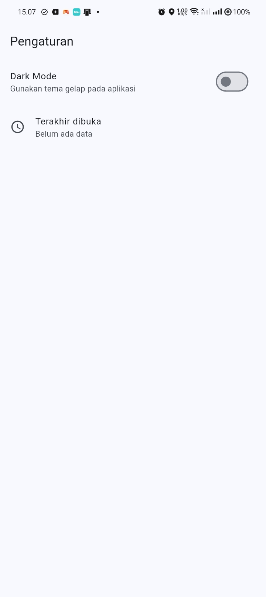<br>

### Dark Mode

Setelah Dark Mode diaktifkan, tampilan aplikasi berubah menjadi tema gelap.

<br>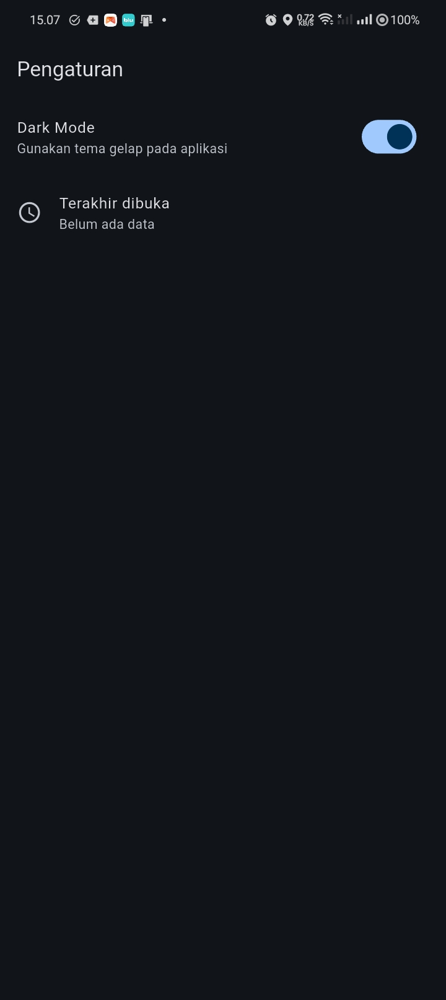<br>

Setelah aplikasi dibuka kembali, waktu terakhir dibuka berhasil tersimpan.

<br>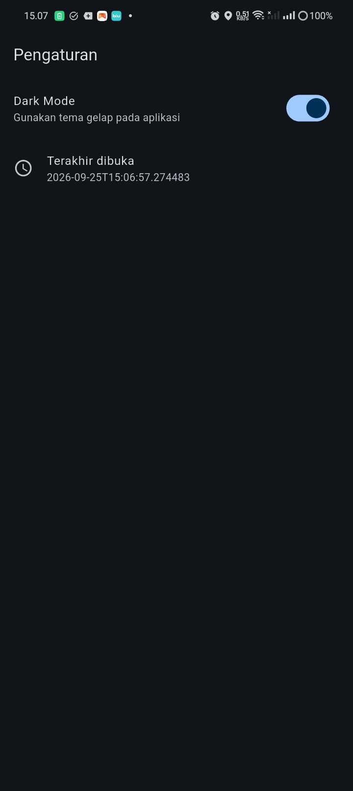<br>

---

## Praktikum 2 - SQLite CRUD

Pada praktikum kedua, SQLite digunakan untuk menyimpan catatan secara lokal melalui `NoteRepository`.

### Kondisi Awal

Pada awalnya belum terdapat catatan dan jumlah data yang belum tersinkronisasi adalah `0`.

<br>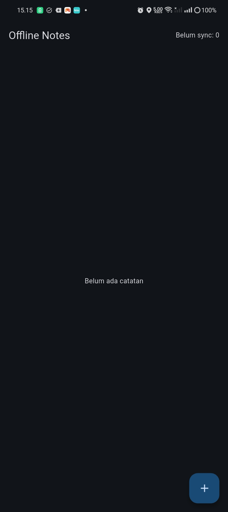<br>

### Menambahkan Catatan

Catatan baru dapat ditambahkan melalui dialog **Tambah Catatan**.

<br>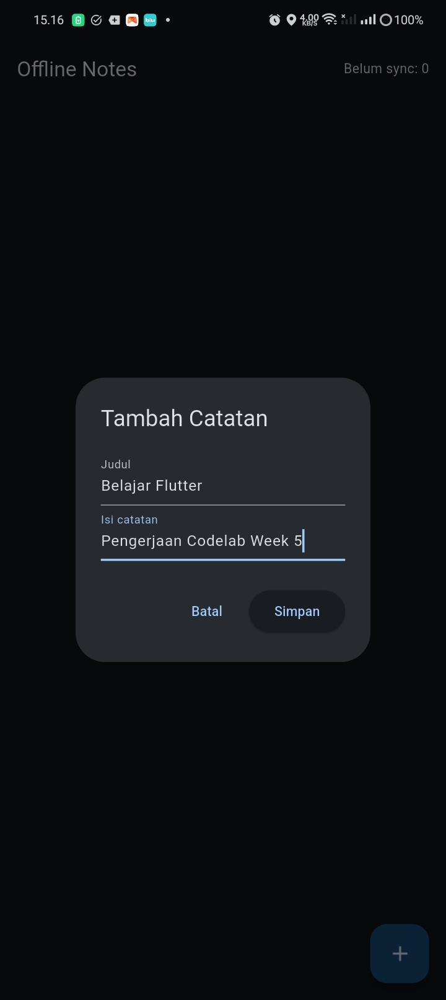<br>

Setelah disimpan, catatan muncul pada halaman Notes dan memiliki status `Belum sync: 1`.

<br>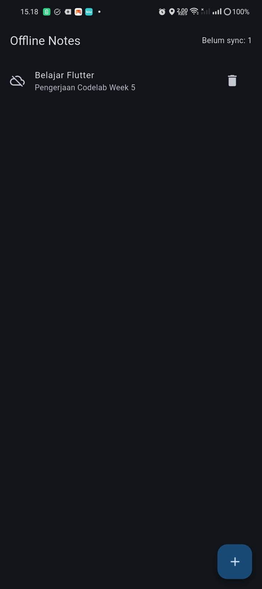<br>

Catatan dapat dihapus menggunakan tombol delete. Setelah dihapus, daftar kembali kosong.

<br><br>

Data baru juga tetap dapat disimpan secara lokal dengan status belum tersinkronisasi.

<br>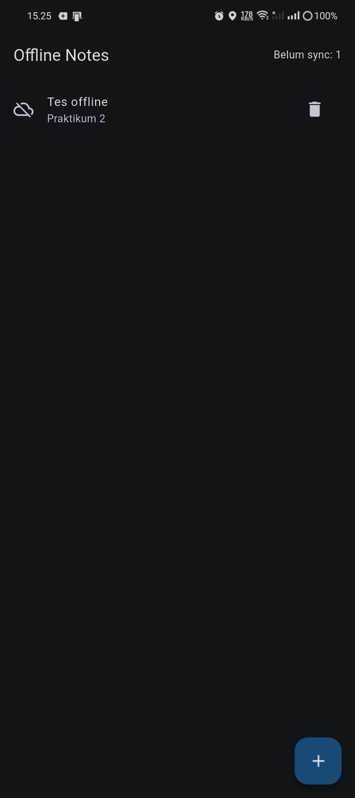<br>

---

## Praktikum 3 - Offline-First

Pada praktikum ketiga diterapkan konsep **offline-first** menggunakan `dirty flag`, proses sinkronisasi, dan cache lokal.

Catatan yang belum tersinkronisasi memiliki `dirty = true`.

### Dirty dan Sync

Catatan baru memiliki status:

```text
Belum sync: 1
```

<br>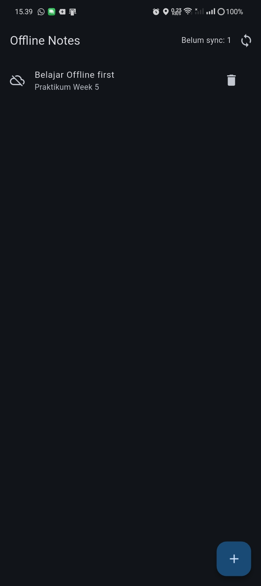<br>

Setelah tombol Sync ditekan, status berubah menjadi:

```text
Belum sync: 0
```

<br>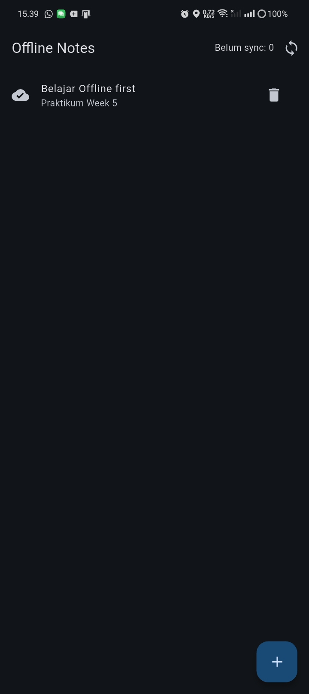<br>

### Cache-First Posts

Data Posts diambil dari JSONPlaceholder dan disimpan pada cache lokal.

<br>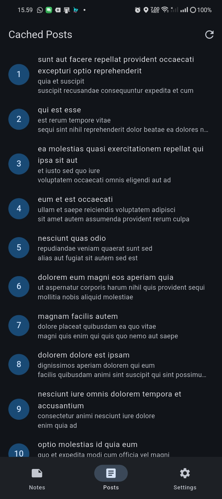<br>

Saat mode pesawat diaktifkan, data Posts tetap dapat ditampilkan karena sebelumnya sudah tersimpan pada cache.

<br>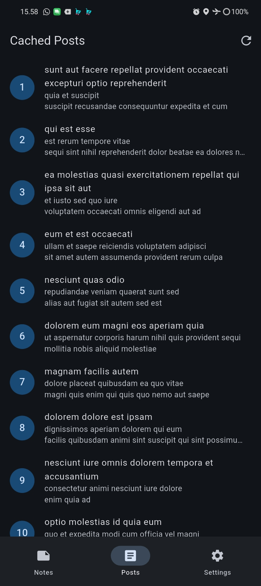<br>

### NavigationBar

Aplikasi memiliki NavigationBar untuk berpindah antara halaman **Notes, Posts, dan Settings**.

<br>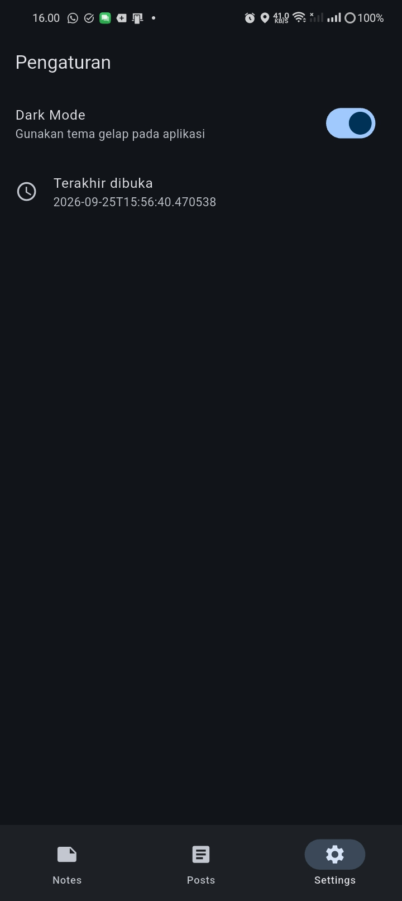<br>

---

## Pengujian Offline Notes

Mode pesawat juga digunakan untuk membuktikan bahwa Notes tetap tersimpan secara lokal.

Saat offline, catatan masih dapat ditampilkan dengan status `Belum sync: 1`.

<br>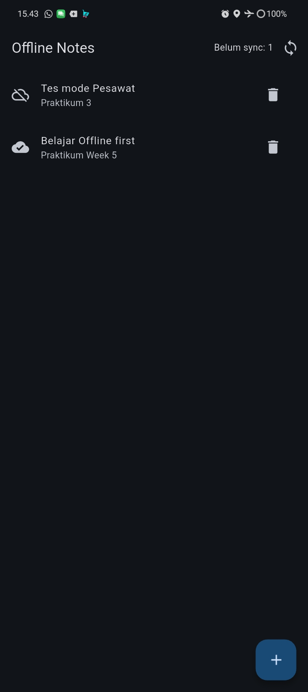<br>

Setelah mode pesawat dimatikan, catatan masih berstatus belum tersinkronisasi.

<br>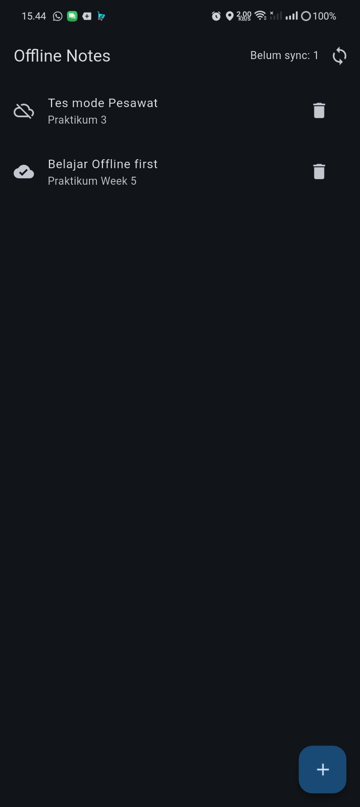<br>

Setelah proses sinkronisasi, status berubah menjadi `Belum sync: 0`.

<br>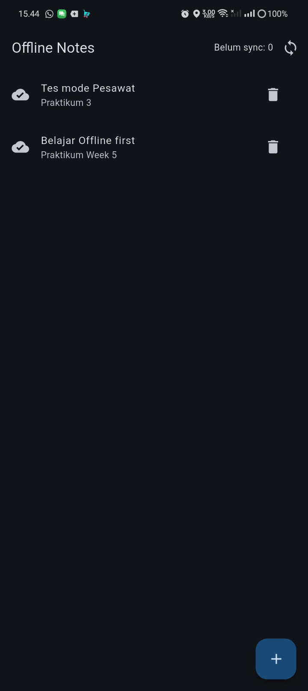<br>

---

## Aturan Konflik

Aturan konflik yang digunakan adalah **Last Write Wins (LWW)** berdasarkan `updated_at`.

Jika terdapat data lokal dan remote yang berbeda, data dengan waktu `updated_at` terbaru dianggap sebagai data terbaru.

Pada project ini proses sinkronisasi Notes masih berupa simulasi menggunakan `syncNotes()`.

---

## Refactoring Challenge

Pada refactoring, tampilan catatan dipisahkan menjadi widget `NoteTile`.

Catatan yang memiliki `dirty = true` menampilkan tulisan **Belum tersinkron**.

<br>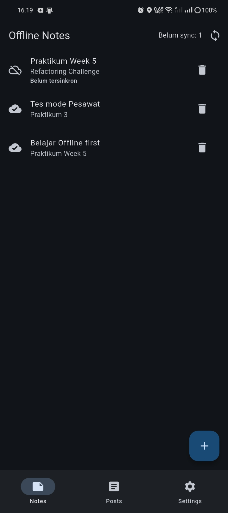<br>

Setelah sinkronisasi, status `Belum sync` berubah menjadi `0`.

<br>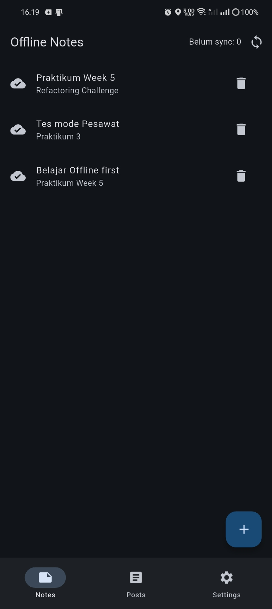<br>

Selain itu dibuat halaman **Detail Note** menggunakan GoRouter. Data detail dibaca berdasarkan ID dari repository lokal.

<br>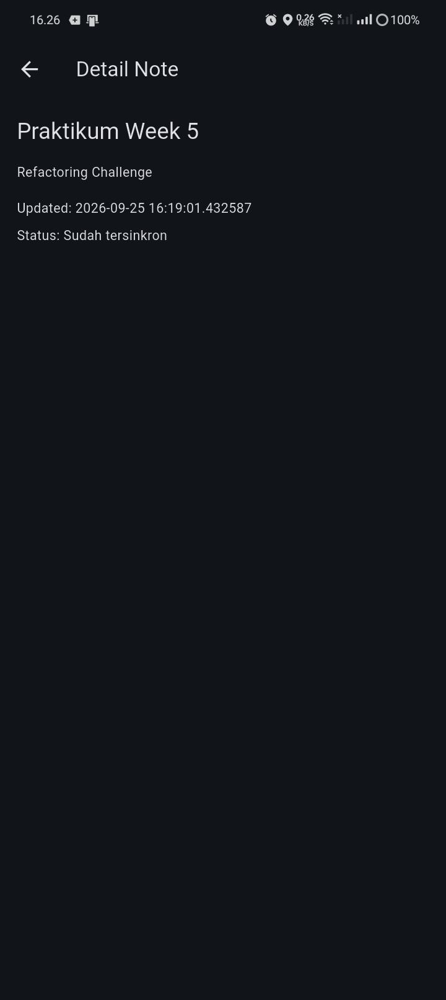<br>

---

## Testing

Testing dilakukan menggunakan `FakeNoteRepository` agar tidak menggunakan database SQLite asli.

Test yang dilakukan:

1. `Note.fromMap()` dengan field yang hilang.
2. Serialisasi nilai `dirty`.
3. Provider berhasil mengambil data dari fake repository.
4. Provider menangani error dari fake repository.

Hasil pengujian:

```text
flutter test
All tests passed!

flutter analyze
No issues found!
```

<br>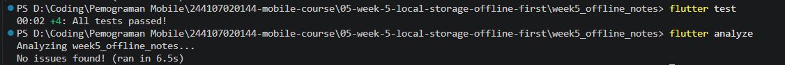<br>

---

## AI Challenge

Pada AI Challenge dilakukan perbandingan **SharedPreferences, Hive, sqflite, dan Drift**.

| Storage | Kegunaan |
|---|---|
| SharedPreferences | Menyimpan data sederhana seperti tema |
| Hive | Penyimpanan NoSQL lokal |
| sqflite | Penyimpanan data terstruktur dengan SQLite |
| Drift | SQLite dengan type safety dan reactive stream |

Dari hasil verifikasi, schema awal dari AI belum memiliki field `dirty`. Field tersebut diperlukan untuk menandai data yang belum tersinkronisasi.

Pada project ini saya tetap menggunakan **sqflite** karena sesuai dengan kebutuhan praktikum.

Dokumentasi AI Challenge disimpan pada folder `docs/`.

---

## Cara Menjalankan

```bash
flutter pub get
flutter run
```

Untuk menjalankan testing dan analisis:

```bash
flutter test
flutter analyze
```

---

## Hasil

Aplikasi berhasil menggunakan **SharedPreferences** untuk menyimpan tema dan waktu terakhir dibuka serta **SQLite** untuk menyimpan Notes secara lokal.

Notes tetap dapat digunakan ketika perangkat offline. `dirty flag` digunakan untuk membedakan catatan yang belum dan sudah tersinkronisasi. Data Posts yang sudah tersimpan pada cache juga tetap dapat ditampilkan saat mode pesawat.

Hasil pengujian akhir:

```text
4 tests passed
No issues found!
```