# Week 6 - Authentication, Security, dan Firebase Cloud Messaging

**Nama:** Raditya Zandra Fadhillah  
**Kelas:** TI-2B  

## Campus Notification App

Campus Notification App merupakan aplikasi Flutter sederhana yang dibuat untuk mempelajari penerapan autentikasi, penyimpanan token secara aman, Firebase Cloud Messaging (FCM), local notification, dan deep linking.

Pada aplikasi ini pengguna harus melakukan login terlebih dahulu. Setelah berhasil login, aplikasi dapat menerima notifikasi pengumuman kampus melalui Firebase Cloud Messaging. Ketika notifikasi ditekan, aplikasi akan membuka halaman detail pengumuman sesuai dengan route yang dikirim melalui data FCM.

---

## Tujuan

Tujuan dari praktikum ini adalah:

1. Menerapkan autentikasi pada aplikasi Flutter.
2. Menyimpan access token dan refresh token menggunakan secure storage.
3. Menangani refresh token ketika API mengembalikan status 401.
4. Mengintegrasikan Firebase Cloud Messaging.
5. Menampilkan notifikasi pada kondisi foreground, background, dan terminated.
6. Menerapkan deep linking dari notifikasi menuju halaman tertentu.
7. Menggunakan topic FCM untuk pengiriman notifikasi.
8. Melakukan refactoring dan unit testing terhadap logika aplikasi.

---

# Praktikum 1 - Authentication dan Security

Pada praktikum pertama dibuat proses login sederhana menggunakan mock authentication.

Access token dan refresh token disimpan menggunakan `flutter_secure_storage` agar tidak disimpan dalam penyimpanan biasa seperti SharedPreferences.

Aplikasi juga menggunakan GoRouter untuk melakukan route guard. Jika pengguna belum login, pengguna akan diarahkan ke halaman `/login`. Jika sudah login, pengguna dapat masuk ke halaman utama.

## Halaman Login

Halaman login digunakan untuk memasukkan email dan password.

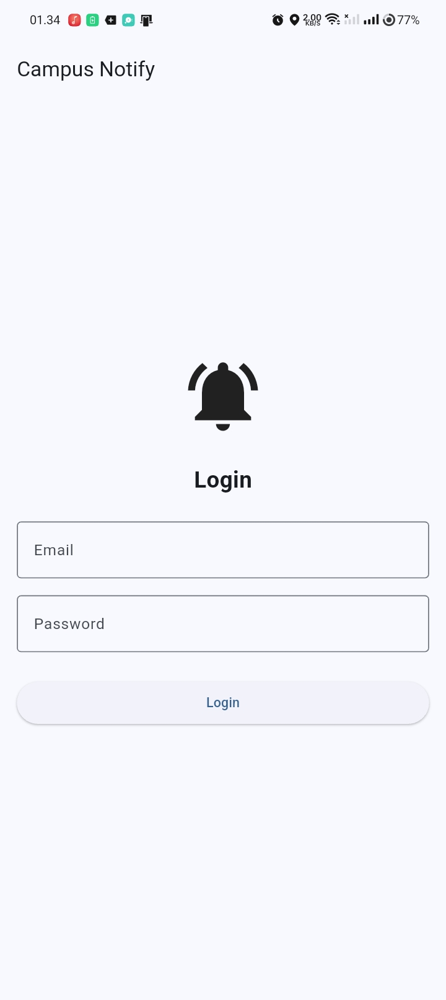

## Login Berhasil

Jika email dan password benar, pengguna akan diarahkan menuju halaman utama Campus Notify.

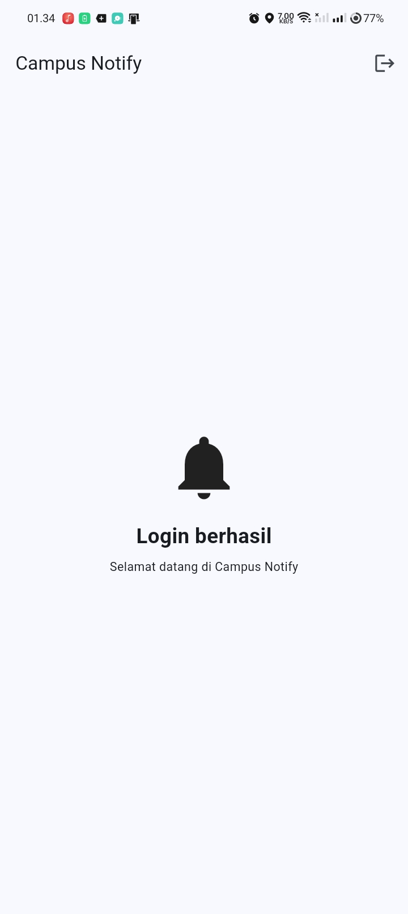

## Login Gagal

Jika email atau password tidak sesuai, aplikasi akan menampilkan pesan bahwa login gagal.

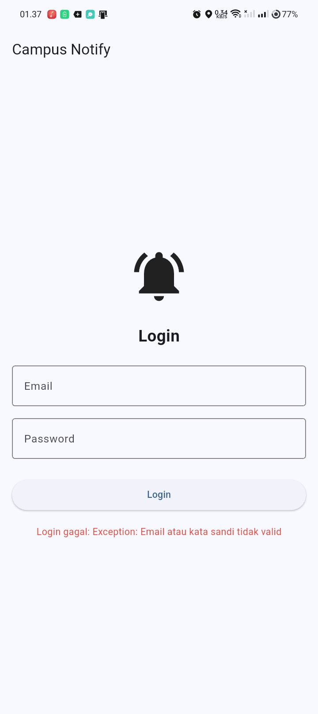

## Logout

Pengguna dapat melakukan logout melalui tombol logout pada halaman utama. Setelah logout, token akan dihapus dan pengguna kembali ke halaman login.

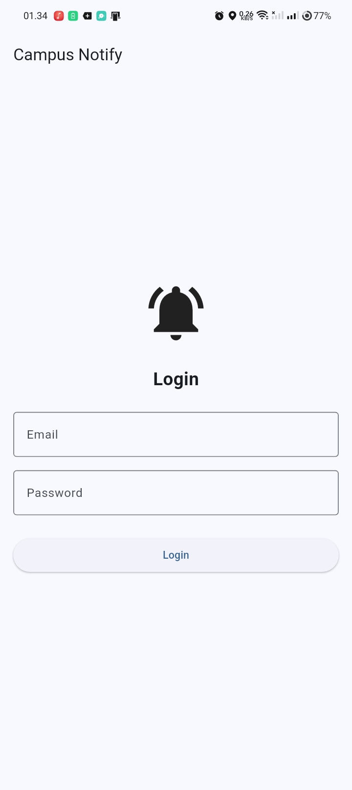

---

# Praktikum 2 - Firebase Cloud Messaging

Pada praktikum kedua aplikasi dihubungkan dengan Firebase Cloud Messaging.

FCM digunakan agar aplikasi dapat menerima notifikasi yang dikirim melalui Firebase.

Beberapa proses yang dilakukan adalah:

- Inisialisasi Firebase.
- Meminta permission notifikasi.
- Mendapatkan FCM token.
- Mendengarkan perubahan token dengan `onTokenRefresh`.
- Subscribe ke topic `pengumuman-kampus`.
- Menerima notifikasi dari Firebase.

## Permission Notifikasi

Pada Android 13 atau versi yang lebih baru, aplikasi meminta izin kepada pengguna sebelum dapat menampilkan notifikasi.

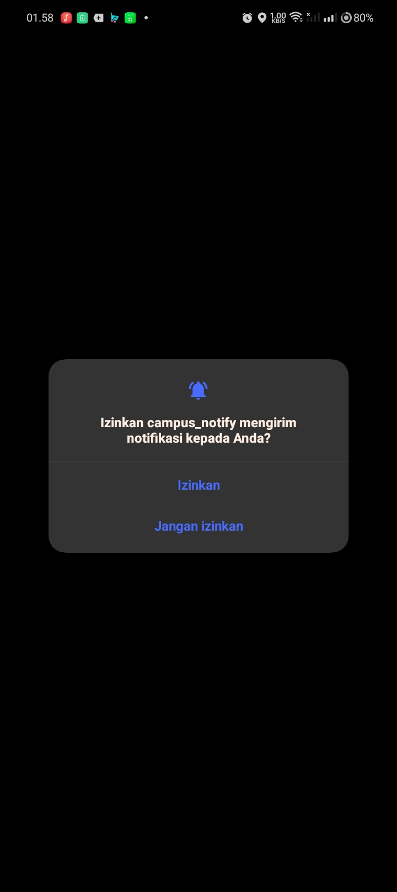

## FCM Token

Setelah Firebase berhasil diinisialisasi, aplikasi mendapatkan FCM token perangkat.

Token digunakan sebagai identitas perangkat untuk menerima pesan FCM.

> Token tidak ditampilkan secara penuh pada dokumentasi karena token perangkat termasuk data yang perlu dijaga.

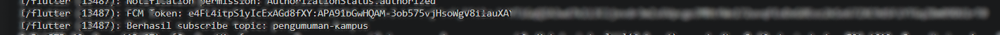

## Notifikasi Masuk

Setelah perangkat berhasil terhubung dengan Firebase, notifikasi dapat dikirim melalui Firebase Console dan diterima oleh perangkat.

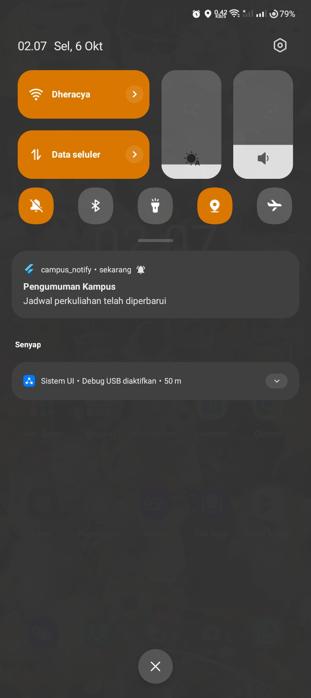

---

# Praktikum 3 - Notification dan Deep Linking

Pada praktikum ketiga dilakukan pengujian notifikasi pada tiga kondisi aplikasi:

1. Foreground
2. Background
3. Terminated

Payload FCM juga membawa data route yang digunakan untuk menentukan halaman tujuan.

Contoh data yang digunakan:

```text
route = /pengumuman/3
id = 3
```

Ketika notifikasi ditekan, aplikasi akan membuka halaman:

```text
/pengumuman/3
```

dan menampilkan:

```text
Pengumuman ID: 3
```

---

## 1. Foreground

Foreground adalah kondisi ketika aplikasi sedang terbuka dan digunakan oleh pengguna.

Pada kondisi ini, pesan diterima melalui:

```dart
FirebaseMessaging.onMessage
```

Karena notifikasi foreground tidak selalu ditampilkan secara otomatis oleh sistem, aplikasi menampilkan local notification menggunakan `flutter_local_notifications`.

### Hasil Notifikasi Foreground

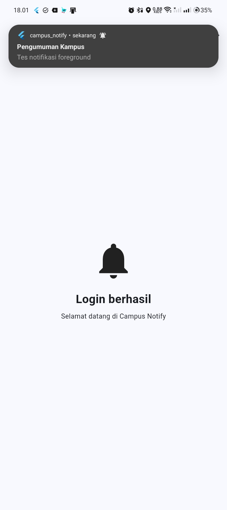

### Pesan Foreground pada Terminal

Terminal menunjukkan bahwa pesan FCM berhasil diterima ketika aplikasi sedang foreground.

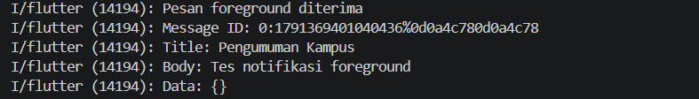

### Deep Link Foreground

Setelah notifikasi ditekan, aplikasi berhasil membuka halaman detail pengumuman dengan ID yang sesuai.

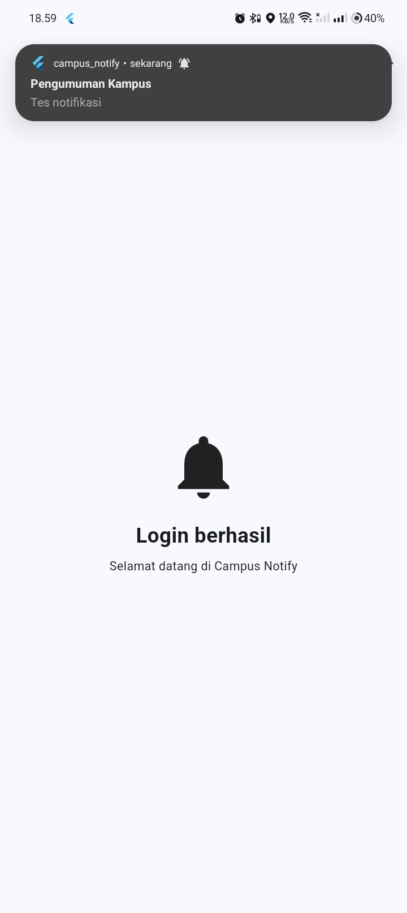

---

## 2. Background

Background adalah kondisi ketika aplikasi masih berjalan tetapi sedang tidak tampil di layar.

Pada kondisi ini notifikasi ditampilkan oleh sistem Android.

Ketika notifikasi ditekan, aplikasi menangani pesan melalui:

```dart
FirebaseMessaging.onMessageOpenedApp
```

### Hasil Notifikasi Background

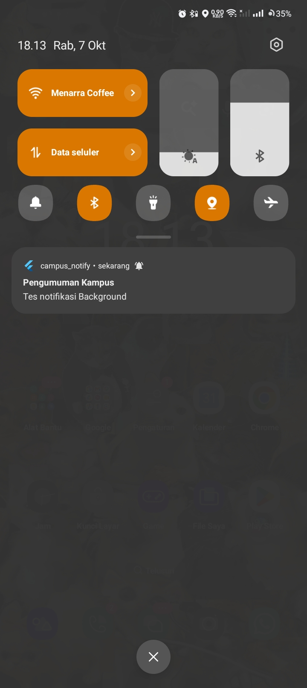

### Pesan Background pada Terminal

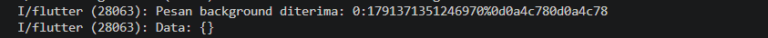

### Deep Link Background

Setelah notifikasi ditekan, aplikasi berhasil membuka halaman detail pengumuman.

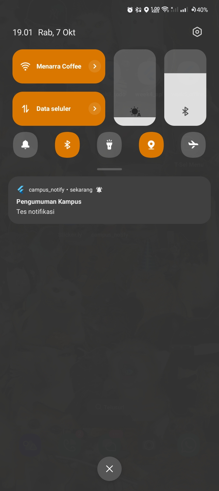

---

## 3. Terminated

Terminated adalah kondisi ketika aplikasi sudah ditutup.

Notifikasi tetap dapat diterima melalui Firebase Cloud Messaging.

Ketika pengguna menekan notifikasi, aplikasi mengambil pesan awal menggunakan:

```dart
FirebaseMessaging.instance.getInitialMessage()
```

Kemudian data route digunakan untuk membuka halaman yang sesuai.

### Hasil Notifikasi Terminated


### Deep Link Terminated

Setelah notifikasi ditekan, aplikasi berhasil dibuka dan diarahkan menuju halaman detail pengumuman.

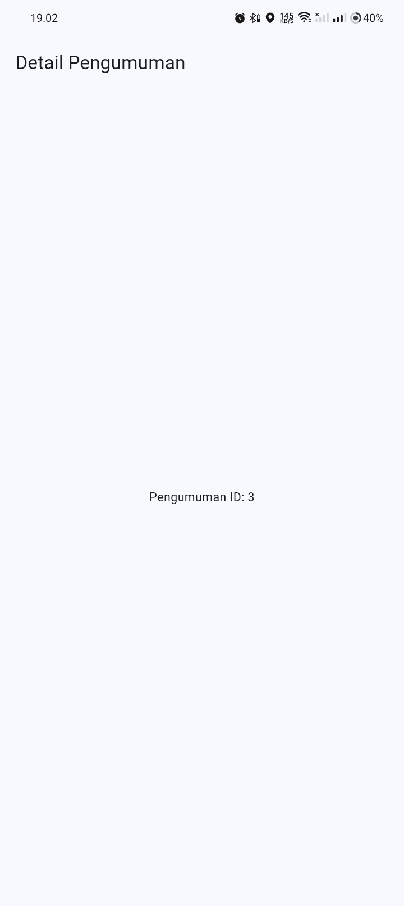

---

# Hasil Pengujian Tiga App State

| Kondisi | Notifikasi | Klik Notifikasi | Route | Hasil |
|---|---|---|---|---|
| Foreground | Local notification tampil | Berhasil | `/pengumuman/3` | Berhasil |
| Background | System notification tampil | Berhasil | `/pengumuman/3` | Berhasil |
| Terminated | System notification tampil | Berhasil | `/pengumuman/3` | Berhasil |

Berdasarkan pengujian tersebut, notifikasi dapat diterima pada ketiga kondisi aplikasi dan deep link berhasil membuka halaman pengumuman yang sesuai.

---

# Topic FCM

Aplikasi menggunakan topic:

```text
pengumuman-kampus
```

Topic digunakan untuk mengirim pengumuman yang ditujukan kepada banyak pengguna.

Subscribe dilakukan menggunakan:

```dart
FirebaseMessaging.instance.subscribeToTopic(
  'pengumuman-kampus',
);
```

Aplikasi juga menyediakan proses unsubscribe topic menggunakan:

```dart
FirebaseMessaging.instance.unsubscribeFromTopic(
  'pengumuman-kampus',
);
```

Hasil subscribe topic dapat dilihat pada terminal berikut.

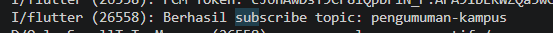

---

# Background Handler

Aplikasi memiliki background handler FCM yang dibuat sebagai fungsi top-level.

```dart
@pragma('vm:entry-point')
Future<void> firebaseMessagingBackgroundHandler(
  RemoteMessage message,
) async {
  await Firebase.initializeApp();

  debugPrint(
    'Pesan background diterima: ${message.messageId}',
  );

  debugPrint(
    'Data: ${message.data}',
  );
}
```

Background handler tidak menggunakan `BuildContext` karena proses background tidak boleh bergantung pada UI aplikasi.

---

# Token Lifecycle

FCM token didapatkan menggunakan:

```dart
FirebaseMessaging.instance.getToken();
```

Aplikasi juga mendengarkan perubahan token menggunakan:

```dart
FirebaseMessaging.instance.onTokenRefresh
```

Ketika token berubah, token baru diarahkan untuk dikirim ke backend melalui:

```text
POST /devices
```

Data yang dikirim berupa:

```json
{
  "token": "FCM_TOKEN",
  "platform": "android"
}
```

Pada praktikum ini implementasi endpoint `/devices` sudah disiapkan pada aplikasi, tetapi pengiriman ke backend asli belum diuji karena backend kampus belum tersedia.

Token tidak di-hardcode di dalam source code dan tidak ditampilkan secara penuh pada dokumentasi.

---

# Refresh Token dan 401

Aplikasi menggunakan Dio interceptor untuk menangani access token yang sudah tidak berlaku.

Alurnya adalah:

```text
Request API
    ↓
Response 401
    ↓
Ambil refresh token
    ↓
Refresh access token
    ↓
Simpan access token baru
    ↓
Ulangi request
```

Jika proses refresh token gagal, token akan dihapus sehingga pengguna harus melakukan login kembali.

Dengan cara ini aplikasi tidak terus menerus melakukan request menggunakan access token yang sudah tidak berlaku.

---

# Refactoring

Untuk membuat kode lebih rapi dan mudah diuji, dilakukan beberapa refactoring.

## routes.dart

Semua route aplikasi dipindahkan ke:

```text
lib/routes.dart
```

Contohnya:

```dart
class AppRoutes {
  static const home = '/';
  static const login = '/login';

  static const announcementPattern =
      '/pengumuman/:id';

  static String announcement(String id) {
    return '/pengumuman/$id';
  }
}
```

Selain itu dibuat fungsi:

```dart
routeFromMessage()
```

untuk mengambil route dari data FCM tanpa bergantung langsung pada Firebase.

---

## api_errors.dart

Pemetaan error Dio dipisahkan ke:

```text
lib/data/api_errors.dart
```

Beberapa error yang ditangani:

| Error | Pesan |
|---|---|
| 401 | Sesi telah berakhir. Silakan login kembali. |
| Timeout | Koneksi timeout. Silakan coba lagi. |
| Offline | Tidak ada koneksi internet. |
| Error lainnya | Terjadi kesalahan. Silakan coba lagi. |

Tujuannya agar UI menerima pesan yang mudah dipahami dan tidak perlu menangani `DioException` secara langsung.

---

# Unit Testing

Unit testing dibuat pada:

```text
test/auth_push_test.dart
```

Pengujian dilakukan terhadap logika aplikasi tanpa menggunakan Firebase secara langsung.

Beberapa hal yang diuji antara lain:

- Parsing route FCM.
- Route tanpa `/`.
- Payload ID pengumuman.
- Status login berdasarkan access token.
- Kondisi refresh token gagal.
- Penanganan error 401.
- Penanganan timeout.

Pengujian dijalankan menggunakan:

```bash
flutter test
```

Hasil pengujian:

```text
All tests passed!
```

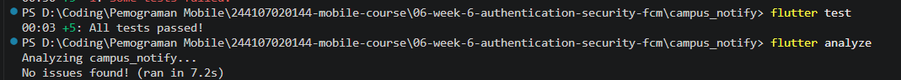

---

# Flutter Analyze

Selain unit testing, dilakukan pengecekan source code menggunakan:

```bash
flutter analyze
```

Hasil:

```text
No issues found!
```

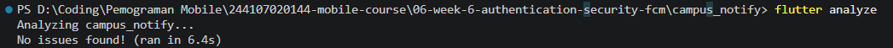

Hal tersebut menunjukkan bahwa tidak ditemukan masalah oleh static analyzer Flutter pada source code yang dibuat.

---

# AI Challenge

Pada AI Challenge digunakan AI untuk membantu membuat dan mengevaluasi implementasi `PushService`.

Prompt, output awal AI, proses verifikasi, dan perbaikan manual didokumentasikan pada folder:

```text
docs/
├── prompt.md
├── output_ai.md
├── verification.md
├── perbaikan.md
└── testing.md
```

Beberapa bagian yang diverifikasi secara manual adalah:

- Background handler harus top-level.
- Menggunakan `@pragma('vm:entry-point')`.
- `onTokenRefresh` diarahkan ke `POST /devices`.
- Foreground notification ditampilkan secara manual.
- Background menggunakan `onMessageOpenedApp`.
- Terminated menggunakan `getInitialMessage()`.
- Deep link menuju route yang benar.
- Token tidak di-hardcode.
- Background handler tidak menggunakan `BuildContext`.

Pada saat pengujian ditemukan masalah pada Custom Data Firebase karena key `route` memiliki spasi tambahan.

Data awal terbaca seperti:

```text
{route          : /pengumuman/3, id: 3}
```

Kemudian Custom Data diperbaiki menjadi:

```text
route = /pengumuman/3
id = 3
```

Setelah diperbaiki, deep linking berhasil pada foreground, background, dan terminated.

---

# Teknologi yang Digunakan

Project ini menggunakan:

- Flutter
- Dart
- Firebase Core
- Firebase Cloud Messaging
- flutter_local_notifications
- flutter_secure_storage
- Dio
- Riverpod
- GoRouter
- Flutter Test

---

# Struktur Project

```text
campus_notify/
├── lib/
│   ├── data/
│   │   ├── api_client.dart
│   │   ├── api_errors.dart
│   │   ├── auth_repository.dart
│   │   └── token_store.dart
│   │
│   ├── messaging/
│   │   └── push_service.dart
│   │
│   ├── pages/
│   │   ├── announcement_page.dart
│   │   ├── home_page.dart
│   │   └── login_page.dart
│   │
│   ├── providers/
│   │   └── auth_provider.dart
│   │
│   ├── main.dart
│   ├── router.dart
│   └── routes.dart
│
├── test/
│   └── auth_push_test.dart
│
├── docs/
│   ├── prompt.md
│   ├── output_ai.md
│   ├── verification.md
│   ├── perbaikan.md
│   └── testing.md
│
├── screenshots/
│   └── hasil pengujian
│
├── README.md
└── pubspec.yaml
```

---

# Cara Menjalankan Project

## 1. Clone Repository

```bash
git clone <repository>
```

Masuk ke folder project:

```bash
cd 06-week-6-authentication-security-fcm/campus_notify
```

## 2. Install Dependency

```bash
flutter pub get
```

## 3. Jalankan Aplikasi

Pastikan perangkat Android atau emulator sudah terhubung.

```bash
flutter run
```

## 4. Jalankan Unit Test

```bash
flutter test
```

## 5. Jalankan Flutter Analyze

```bash
flutter analyze
```

---

# Hasil yang Dicapai

Setelah seluruh praktikum selesai, aplikasi berhasil menjalankan beberapa fitur utama yaitu:

- Login dan logout.
- Route guard berdasarkan status autentikasi.
- Penyimpanan token menggunakan secure storage.
- Refresh access token ketika mendapatkan response 401.
- Permission notifikasi Android.
- Mendapatkan FCM token.
- Subscribe topic `pengumuman-kampus`.
- Menerima notifikasi foreground.
- Menerima notifikasi background.
- Menerima notifikasi terminated.
- Local notification pada foreground.
- Deep linking menuju `/pengumuman/3`.
- Unit testing berhasil.
- `flutter analyze` tidak menemukan masalah.

---

# Kesimpulan

Pada praktikum Week 6 ini saya mempelajari bahwa implementasi notifikasi tidak hanya sekadar menampilkan pesan pada perangkat. Aplikasi juga harus memperhatikan keamanan token, status aplikasi ketika menerima pesan, serta proses navigasi ketika notifikasi ditekan.

Firebase Cloud Messaging dapat menangani pengiriman pesan, sedangkan `flutter_local_notifications` digunakan untuk membantu menampilkan notifikasi secara manual ketika aplikasi berada pada kondisi foreground.

Deep linking memungkinkan pengguna langsung menuju halaman pengumuman tertentu berdasarkan data `route` yang dikirim melalui FCM.

Selain itu, penggunaan secure storage, refresh token, refactoring, dan unit testing membuat aplikasi lebih aman, terstruktur, dan lebih mudah diuji.

Dari hasil pengujian, notifikasi berhasil diterima pada kondisi foreground, background, dan terminated serta berhasil membuka halaman `/pengumuman/3` sesuai data yang dikirim.